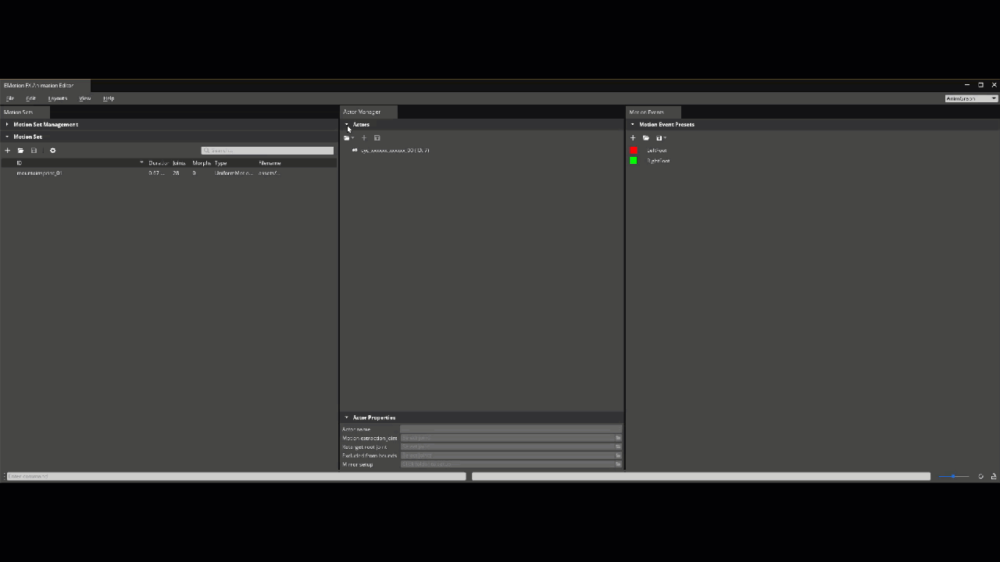

# Animation Editor Workflow Tests

Testing in this area should focus on the general usage workflows of the Animation Editor.

## General Docs

* [O3DE Animation Editor Concepts and Terms](https://www.o3de.org/docs/user-guide/visualization/animation/character-editor/concepts-and-terms/)
* [O3DE Animation Editor User Interface](https://www.o3de.org/docs/user-guide/visualization/animation/animation-editor/user-interface/)
* [O3DE Getting Started With Animation Editor](https://www.o3de.org/docs/user-guide/visualization/animation/animation-editor/quick-start/)

## Common Issues to Watch For

Test guidance will sometimes note specific issues to watch for. The common issues below should be watched for through all testing, even if unrelated to the current workflow being tested.
- Asset processor errors when saving animation settings
- Warnings or Errors that appear in the Editor Console Log while setting up or running scenes.
- Errors appearing in the Animation Editor's Log Window view.
- Broken Animation behaviors.

## Workflow Variants

### Source Nodes

* Bind Pose
* State Machine
* Motion
* Entry
* Reference
* Blend Tree
* Hub

## Workflows

### Area: Animation Editor Behaviors

**Description:** Testing in this area will focus on basic Animation Editor behaviors such as docking, editor layout and management, Actor importing, and animation rendering.

**Project Requirements:**

Any project that has the following Gems enabled: 
* _O3DE\Gems\EMotionFX_
* _O3DE\Gems\ScriptedEntityTweener_
* _O3DE\Gems\PrimitiveAssets_

Assets:
* An Actor that is set up to work with animations.
* Animations for your Actor.

**Platforms:**
* Windows
* Linux

**Docs:** 
* [O3DE Animation Editor User Interface](https://www.o3de.org/docs/user-guide/visualization/animation/animation-editor/user-interface/)
* [O3DE Getting Started With Animation Editor](https://www.o3de.org/docs/user-guide/visualization/animation/animation-editor/quick-start/)

**Product:** A configured animation editor for the user's needs. 

**Suggested Time Box:** 60 minutes

| Workflow                                                    | Requests                                                                                                                                                                                                                                                                                                                                                                                                                                                                                                                                                                                                                                                                                                                                                                  | Things to Watch For                                                                                                                                                                                                                                                                                                                                                                                                                                                                                                                                                                                                                                                                                                                                                                                                                                                                                                                                                                                                                                                                                                                                                                                                                                                                                                                                |
|-------------------------------------------------------------|---------------------------------------------------------------------------------------------------------------------------------------------------------------------------------------------------------------------------------------------------------------------------------------------------------------------------------------------------------------------------------------------------------------------------------------------------------------------------------------------------------------------------------------------------------------------------------------------------------------------------------------------------------------------------------------------------------------------------------------------------------------------------|----------------------------------------------------------------------------------------------------------------------------------------------------------------------------------------------------------------------------------------------------------------------------------------------------------------------------------------------------------------------------------------------------------------------------------------------------------------------------------------------------------------------------------------------------------------------------------------------------------------------------------------------------------------------------------------------------------------------------------------------------------------------------------------------------------------------------------------------------------------------------------------------------------------------------------------------------------------------------------------------------------------------------------------------------------------------------------------------------------------------------------------------------------------------------------------------------------------------------------------------------------------------------------------------------------------------------------------------------|
| **Launch and configure the Animation Editor**               | <ol><li>Open the O3DE Editor.</li><li>Open the Animation Editor (using varying entry points):</li><ul><li>O3DE Toolbar → Tools → Animation Editor</li><li>Actor Component's Actor asset property field.</li></ul><li>Resize the Animation Editor to desired size.</li><li>Dock/Undock editor to desired position.</li><li>Select the desired Layout.</li><li>Move Animation Editor panels around within the Animation Editor</li><li>Open and close Separator Widgets on various panels.<ul><li>Motion Sets</li><li>Motion Events</li><li>Actor Manager</li></ul></li></ol>                                                                                                                                                                        | <ul><li>Animation Editor launches</li><li>Animation Editor Resizes.</li><li>Animation Editor docks as expected.</li><li>Layouts will quickly switch between different View configurations.</li><li>Separator widgets can be collapsed and expanded while the parent layout resizes accordingly. [o3de/o3de#10958](https://github.com/o3de/o3de/issues/10958), [o3de/o3de#10960](https://github.com/o3de/o3de/issues/10960) <ul><li> </li></ul></li></ul>                                                                                                                                                                                                                                                                                                                                                                                                                                                                                                                                                                                                                                                                                                                                                                                                                                                           |
| **Import an Actor and render an animation using various cameras** | <ol><li>Open the Animation Editor.</li><li>Import an Actor.</li><li>Use the Actor Manager to set the Motion Extraction Joint.</li><li>In Motion Sets add the motions you want to play and save the motion sets you created.</li><li>Select the motion that you want to play and click play in the Time View.</li><li>While animation plays switch between cameras.</li><li>Save the Actor.</li></ol>                                                                                                                                                                                                                                                                                                                                                                      | <ul><li>Actor Imports without any issues.</li><li>Joint is set when selected.</li><li>When Selecting a joint and using Find Best Match, a joint is selected.</li><li>Motion Sets Can be Created, Updated, Deleted.</li><li>Motions can be added, updated, and deleted to/from motion sets.</li><li>Motion Sets save and process in the Asset Processor.</li><li>Animation Editor's Viewport renders the animation when the motion is played and stops playing when stopped.</li><li>When another animation is played, the previously playing animations stops immediately before playing the next animation.</li><li>Animation render plays as expected while the camera views change.</li></ul>                                                                                                                                                                                                                                                                                                                                                                                                                                                                                                                                                                                                                                                   |
| **Create and load a custom Workspace**                      | <ol><li>Open the Animation Editor.</li><li>Create a partial actor workflow.</li><li>Save the workspace and close out of the Animation Editor.</li><li>Open the Animation Editor back up a previously created workspace.</li></ol>                                                                                                                                                                                                                                                                                                                                                                                                                                                                                                                                         | <ul><li>Workspace saves and is processed by the Asset Processor.</li><li>Animation Editor loads in the Actor, Motion Sets, Motions, and other modified fields.</li></ul>                                                                                                                                                                                                                                                                                                                                                                                                                                                                                                                                                                                                                                                                                                                                                                                                                                                                                                                                                                                                                                                                                                                                                                           |
| **Create a custom Layout**                                  | <ol><li>Open the Animation Editor.</li><li>Close some views.</li><li>Open some unopened views.</li><li>Move and resize views around within the Animation Editor.</li><li>Save the Layout.</li><li>Switch layouts back and forth.</li></ol>                                                                                                                                                                                                                                                                                                                                                                                                                                                                                                                                | <ul><li>Views open and close in the Animation Editor.</li><li>Views move around and resize within animation editor as expected.</li><li>View Saves successfully.</li><li>When switching between Layouts, the views load according to the desired view, including user generated views.</li></ul>                                                                                                                                                                                                                                                                                                                                                                                                                                                                                                                                                                                                                                                                                                                                                                                                                                                                                                                                                                                                                                                   |
| **Modify Actor joints**                                    | <ol><li>Open the Animation Editor.</li><li>Switch to the Physics Layout.</li><li>Import an Actor.</li><li>In the Actor Manager select the actor's Instance.</li><li>In the Skeleton Outliner select the Character root.</li><li>Add a joint to a ragdoll.<ul><li>Right Click → Ragdoll → Add to Ragdoll.</li><li>Ragdoll View Pane → Click **Add to Ragdoll** button.</li></ul></li><li>Add a Hit Detection to a Joint.<ul><li>Right Click → Hit Detection → Add Collider → Desired Shape</li><li>Hit Detection View Pane → Click **Add Hit Detection** button → Desired Shape</li></ul></li><li>Add a Cloth Collider.<ul><li>Right Click → Cloth → Add Collider → Desired Shape.<li>Cloth Colliders View Pane → Click **Add Cloth Collider** button.</li></ul></li></ol> | <ul><li>When selecting the Character node from the **Skeleton Outliner** the Ragdoll, Hit Detection, and Cloth Colliders display as components in the Inspector and allow the user to modify those properties. [o3de/o3de#11313](https://github.com/o3de/o3de/issues/11313)  Additionally the character's actor manager properties are shown in the Inspector view pane. [o3de/o3de#11315](https://github.com/o3de/o3de/issues/11315) </li><li>Skeleton Outliner's Character node uses an icon representiative of a character and the bones use an icon represetative of a bone. [o3de/o3de#13273](https://github.com/o3de/o3de/issues/13273) </li><li>Skeleton Outliner overview makes sense for the Actor imported. Bones and root nodes are grouped as expected. [o3de/o3de#10962](https://github.com/o3de/o3de/issues/10962) </li><li>When selecting a joint node from the **Skeleton Outliner** the Ragdoll, Hit Detection, and Cloth Colliders display as components in the Inspector and allow the user to modify those properties. [o3de/o3de#11313](https://github.com/o3de/o3de/issues/11313) Additionally the joint properties are shown in the Inspector view pane.</li><li>User is able to add a Ragdoll, Hit Detection, or Cloth Collider to joints.</li><li>The Inspector view pane no longer shows the Node Attributes. [o3de/o3de#11314](https://github.com/o3de/o3de/issues/11314) </li></ul> |

---

### Area: Animation Graph Creation

**Description:** Testing in this area will focus on basic testing of the Animation Graph's behaviors and outputs.

**Project Requirements:**

Any project that has the following Gems enabled: 
* _O3DE\Gems\PhysX_ 
* _O3DE\Gems\EMotionFX_
* _O3DE\Gems\ScriptedEntityTweener_
* _O3DE\Gems\PrimitiveAssets_
* _O3DE\Gems\StartingPointInput_

Assets:
* An Actor that is set up to work with animations and set up for the AnimGraph behaviors you want to script.
* Animations for your Actor.
* An Input Bindings file configured to manipulate your Actor's motion properties when a button is pressed.
   * Using an input bindings file from Starting Point Input such as _thirdpersonmovement.inputbindings_ is acceptable 
* A Script Canvas to translate the Input Bindings to the properties set in your Input Bindings file. 
* Example Assets:
   * Examples created using the _Rin.fbx Actor_, _thirdpersonmovement.inputbindings_ from the Starting Point Input Gem, and _MotionMatching.motionset_ assets from the Motion Matching Gem. 
      * [Example AnimGraph](testassets/TestAnimGraph.animgraph)
      * [Example ScriptCanvas](testassets/TestSC.scriptcanvas)
      * [Example File Screenshots](testassets/example-asset-screenshots.md)

Animation Editor Configuration:
**Animation Editor** should be set to the **AnimGraph Layout** or a custom layout that utilizes the **Anim Graph View**.

**Platforms:**
* Windows
* Linux

**Docs:**
* [O3DE Anim Graph Interface](https://www.o3de.org/docs/user-guide/visualization/animation/animation-editor/animation-graph-user-interface/)
* [O3DE Creating an Animation Graph](https://www.o3de.org/docs/user-guide/visualization/animation/animation-editor/quick-start/#step-2-creating-an-animation-graph)
* [O3DE Animation Editor Nodes](https://www.o3de.org/docs/user-guide/visualization/animation/animation-editor/node/)

**Product:** An animation graph.

**Suggested Time Box:** 60 minutes

| Workflow                      | Requests                                                                                                                                                                                                                                                                                                                                                                                                                                                                                                                                                                                                                                                                                                                                                                                                                                                                                                                                                                                                                                                                                                                                                                                                                                                                                                                                                                                                                                                                                                                                                                                                                                                                                                                                                                                       | Things to Watch For                                                                                                                                                                                                                                                                                                                                                                                                                                                                                                                                                                                                                                                                                                                                                                                                                                                                                                                                                                                                                                                                                                                                                                                                                                                                                                                                                                                                                                                                                                                                                                                                                                                                                                                                                                                                                                                                                                                                                                                                                                                                                                                                                                                                                         |
|-------------------------------|------------------------------------------------------------------------------------------------------------------------------------------------------------------------------------------------------------------------------------------------------------------------------------------------------------------------------------------------------------------------------------------------------------------------------------------------------------------------------------------------------------------------------------------------------------------------------------------------------------------------------------------------------------------------------------------------------------------------------------------------------------------------------------------------------------------------------------------------------------------------------------------------------------------------------------------------------------------------------------------------------------------------------------------------------------------------------------------------------------------------------------------------------------------------------------------------------------------------------------------------------------------------------------------------------------------------------------------------------------------------------------------------------------------------------------------------------------------------------------------------------------------------------------------------------------------------------------------------------------------------------------------------------------------------------------------------------------------------------------------------------------------------------------------------|---------------------------------------------------------------------------------------------------------------------------------------------------------------------------------------------------------------------------------------------------------------------------------------------------------------------------------------------------------------------------------------------------------------------------------------------------------------------------------------------------------------------------------------------------------------------------------------------------------------------------------------------------------------------------------------------------------------------------------------------------------------------------------------------------------------------------------------------------------------------------------------------------------------------------------------------------------------------------------------------------------------------------------------------------------------------------------------------------------------------------------------------------------------------------------------------------------------------------------------------------------------------------------------------------------------------------------------------------------------------------------------------------------------------------------------------------------------------------------------------------------------------------------------------------------------------------------------------------------------------------------------------------------------------------------------------------------------------------------------------------------------------------------------------------------------------------------------------------------------------------------------------------------------------------------------------------------------------------------------------------------------------------------------------------------------------------------------------------------------------------------------------------------------------------------------------------------------------------------------------|
| **Import an actor with modified Modifiers and apply desired motions within motion sets.** | <ol><li>Open the FBX Settings for a an actor from the Asset Browser.</li><li>Add any Actor or Motion modifiers from the FBX Settings Motions tab and change the values before saving. </li><li>Open Animation Editor.</li><li>Import the actor that you've modified.</li><li>Add a series of motions and motion sets.</li></ol>                                                                                                                                                                                                                                                                                                                                                                                                                                                                                                                                                                                                                                                                                                                                                                                                                                                                                                                                                                                                                                                                                                                                                                                                                                                                                                                                                                                                                                                                | <ul><li>Modifiers can be applied and saved.</li><li>Actor imports into the Animation Editor.</li><li>Motion Sets and Motions can be added to the Actor.</li></ul>                                                                                                                                                                                                                                                                                                                                                                                                                                                                                                                                                                                                                                                                                                                                                                                                                                                                                                                                                                                                                                                                                                                                                                                                                                                                                                                                                                                                                                                                                                                                                                                                                                                                                                                                                                                                                                                                                                                                                                                                                                                                           |
| **Create an animation graph** | <ol><li>Create a new AnimGraph from the AnimGraph view.</li><li>Add a motion node and another [Source Node](#Source-Nodes) from the Node Palette. (EG: Motion & Blend Tree)<ul><li>Right-Click context menu on the anim graph canvas. [o3de/o3de#10963](https://github.com/o3de/o3de/issues/10963) </li><li>Node Palette View.</li></ul></li><li>Connect the two nodes to each other with transition lines.</li><li>Create parameters to set the conditions to blend between animations and set them to the transition line connections.</li><li>Configure the nodes you've created by modifying their Actions or modifying them by entering their sub-graph (double clicking the node) and changing the behaviors.</li><li>Manage the Nodes by adding them to Node Groups by highlighting the nodes and right clicking them to select the desired node group management. [o3de/o3de#10961](https://github.com/o3de/o3de/issues/10961) <ul><li>Add multiple Node Groups.</li><li>Have Node Groups are created on multiple levels of the graph.</li><li>Move nodes between groups.</li><li>Remove Nodes from Node Groups via Remove Node.</li><li>Rename the Node Groups via Double-Click and Right-Click → Rename. [o3de/o3de#13279](https://github.com/o3de/o3de/issues/13279) </li><li>Save and Close then Re-Open the Anim Graph and add nodes to an existing Node Group. [o3de/o3de#13426](https://github.com/o3de/o3de/issues/13426) </li></ul></li><li>Apply Motions and adjust properties to the motion nodes before wiring each output pose to the pose inputs of the Blend Two node.</li><li>Save the AnimGraph</li><li>Click the Play/Activate AnimGraph button to play the animation in the Animation Editor.</li><li>Modify the parameter values as the AnimGraph plays.</li></ol> | <ul><li>AnimationGraph can be created.</li><li>Nodes can be created via the Node Palette View or the Right-Click Palette which is searchable. [o3de/o3de#10963](https://github.com/o3de/o3de/issues/10963) </li><li>The nodes found in the Right-Click context menu have colored icons next to them. [o3de/o3de#11689](https://github.com/o3de/o3de/issues/11689) </li><li>Parameters can be created, modified, and applied to Transition Lines.</li><li>Parameter details are displayed in the Inspector . [o3de/o3de#10965](https://github.com/o3de/o3de/issues/10965) </li><li>When modifying the parameters verify they Inspector widget renders as expected. [o3de/o3de#13234](https://github.com/o3de/o3de/issues/13234) </li><li>Actions can be created, updated, and deleted from Nodes via the Inspector.</li><li>Source Nodes with sub-graphcs can be entered to define its behavior.</li><li>Node groups can be managed as expected: <ul><li>Multiple node groups can be created.</li><li>Nodes can be added to a node graph via the Right-Click → Assign to Node Group.</li><li>Nodes can be moved between node groups. [o3de/o3de#13416](https://github.com/o3de/o3de/issues/13416) </li><li>Nodes can only be added to node groups on the same level as the node. [o3de/o3de#13232](https://github.com/o3de/o3de/issues/13232) </li><li>Nodes can be removed from groups via the right-click context menu's remove node and unchecking the node from the group from the "Assign to Node Group" menu. [o3de/o3de#13470](https://github.com/o3de/o3de/pull/13470) </li><li>Node Groups can be managed from the right-click context menu.</li><li>Nodes can be added to an existing Node Group from a previously created AnimGraph. [o3de/o3de#13426](https://github.com/o3de/o3de/issues/13426) </li></ul></li><li>When the Play/Activate AnimGraph button is pressed the animation will play according to the current parameter value.</li><li>When the parameter values are adjusted from the Parameter view, the rendered animation will animate arccording to the conditions you've defined.</li><li>Anim Graphs can be saved and found on the file system as well as reopened and modified if closed from the editor.</li></ul> |
---

