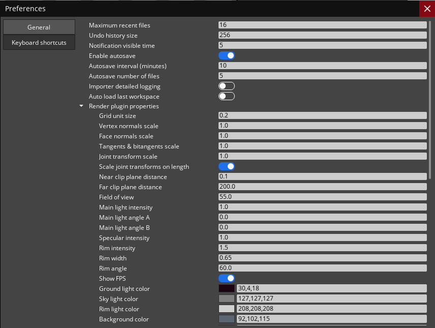
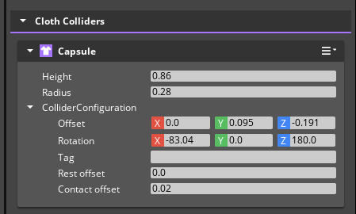
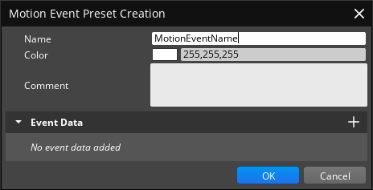
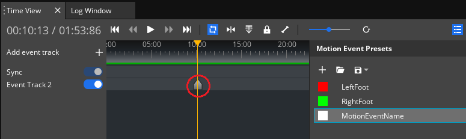
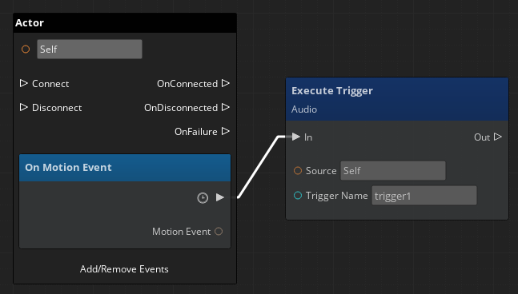

# Animation Editor Workflow Tests

Testing in this area should focus on the general usage workflows of the Animation Editor.

## General Docs

* [O3DE Animation Editor Concepts and Terms](https://www.o3de.org/docs/user-guide/visualization/animation/character-editor/concepts-and-terms/)
* [O3DE Animation Editor User Interface](https://www.o3de.org/docs/user-guide/visualization/animation/animation-editor/user-interface/)
* [O3DE Getting Started With Animation Editor](https://www.o3de.org/docs/user-guide/visualization/animation/animation-editor/quick-start/)

## Common Issues to Watch For

Test guidance will sometimes note specific issues to watch for. The common issues below should be watched for through all testing, even if unrelated to the current workflow being tested.
- Asset processor errors when saving animation settings
- Warnings or Errors that appear in the Editor Console Log while setting up or running scenes.
- Errors appearing in the Animation Editor's Log Window view.
- Broken Animation behaviors.

## Workflow Variants

### Source Nodes

* Bind Pose
* State Machine
* Motion
* Entry
* Reference
* Blend Tree
* Hub

## Workflows

### Area: Animation Editor Behaviors

**Description:** Testing in this area will focus on basic Animation Editor behaviors such as docking, editor layout and management, actor importing, and animation rendering.

**Project Requirements:**

Any project that has the following Gems enabled: 
* _O3DE\Gems\EMotionFX_
* _O3DE\Gems\ScriptedEntityTweener_
* _O3DE\Gems\PrimitiveAssets_

Assets:
* An Actor that is set up to work with animations.
* Animations for your Actor.

**Platforms:**
* Windows
* Linux

**Docs:** 
* [O3DE Animation Editor User Interface](https://www.o3de.org/docs/user-guide/visualization/animation/animation-editor/user-interface/)
* [O3DE Getting Started With Animation Editor](https://www.o3de.org/docs/user-guide/visualization/animation/animation-editor/quick-start/)
* [O3DE Set Up a Simulated Object](https://www.o3de.org/docs/user-guide/visualization/animation/set-up-a-simulated-object/)

**Product:** A configured animation editor for the user's needs. 

**Suggested Time Box:** 60 minutes

| Workflow                                                          | Requests                                                                                                                                                                                                                                                                                                                                                                                                                                                                                                                                                                                                                                                                                                                                                                                                                                                                                                                                                                                | Things to Watch For                                                                                                                                                                                                                                                                                                                                                                                                                                                                                                                                                                                                                                                                                                                                                                                                                                                                                                                                                                                                                                                                                                                                                                                                                                                                                                                                                                                             |
|-------------------------------------------------------------------|-----------------------------------------------------------------------------------------------------------------------------------------------------------------------------------------------------------------------------------------------------------------------------------------------------------------------------------------------------------------------------------------------------------------------------------------------------------------------------------------------------------------------------------------------------------------------------------------------------------------------------------------------------------------------------------------------------------------------------------------------------------------------------------------------------------------------------------------------------------------------------------------------------------------------------------------------------------------------------------------|-----------------------------------------------------------------------------------------------------------------------------------------------------------------------------------------------------------------------------------------------------------------------------------------------------------------------------------------------------------------------------------------------------------------------------------------------------------------------------------------------------------------------------------------------------------------------------------------------------------------------------------------------------------------------------------------------------------------------------------------------------------------------------------------------------------------------------------------------------------------------------------------------------------------------------------------------------------------------------------------------------------------------------------------------------------------------------------------------------------------------------------------------------------------------------------------------------------------------------------------------------------------------------------------------------------------------------------------------------------------------------------------------------------------|
| **Launch and configure the Animation Editor**                     | <ol><li>Open the O3DE Editor.</li><li>Open the Animation Editor (using varying entry points):</li><ul><li>O3DE Toolbar → Tools → Animation Editor</li><li>Actor Component's Actor asset property field.</li></ul><li>Resize the Animation Editor to desired size.</li><li>Dock/Undock editor to desired position.</li><li>Select the desired Layout.</li><li>Move Animation Editor panels around within the Animation Editor</li><li>Open and close Separator Widgets on various panels.<ul><li>Motion Sets</li><li>Motion Events</li><li>Actor Manager</li></ul></li></ol>                                                                                                                                                                                                                                                                                                                                                                                                             | <ul><li>Animation Editor launches</li><li>Animation Editor resizes.</li><li>Animation Editor docks as expected.</li><li>Layouts will quickly switch between different View configurations.</li><li>Separator widgets can be collapsed and expanded while the parent layout resizes accordingly. [o3de/o3de#10958](https://github.com/o3de/o3de/issues/10958), [o3de/o3de#10960](https://github.com/o3de/o3de/issues/10960) <ul><li> </li></ul></li></ul>                                                                                                                                                                                                                                                                                                                                                                                                                                                                                                                                                                                                                                                                                                                                                                                                                                                                                                                        |
| **Import an Actor and render an animation using various cameras** | <ol><li>Open the Animation Editor.</li><li>Import an Actor.</li><li>Use the Actor Manager to set the Motion Extraction Joint.</li><li>In Motion Sets add the motions you want to play and save the motion sets you created.</li><li>Select the motion that you want to play and click play in the Time View.</li><li>While animation plays switch between cameras.</li><li>Save the Actor.</li></ol>                                                                                                                                                                                                                                                                                                                                                                                                                                                                                                                                                                                    | <ul><li>Actor imports without any issues.</li><li>Joint is set when selected.</li><li>When Selecting a joint and using Find Best Match, a joint is selected.</li><li>Motion Sets Can be Created, Updated, Deleted.</li><li>Motions can be added, updated, and deleted to/from motion sets.</li><li>Motion Sets save and process in the Asset Processor.</li><li>Animation Editor's Viewport renders the animation when the motion is played and stops playing when stopped.</li><li>When another animation is played, the previously playing animations stops immediately before playing the next animation.</li><li>Animation render plays as expected while the camera views change.</li></ul>                                                                                                                                                                                                                                                                                                                                                                                                                                                                                                                                                                                                                                                                                                                |
| **Create and load a custom Workspace**                            | <ol><li>Open the Animation Editor.</li><li>Create a partial actor workflow.</li><li>Save the workspace and close out of the Animation Editor.</li><li>Open the Animation Editor back up a previously created workspace.</li></ol>                                                                                                                                                                                                                                                                                                                                                                                                                                                                                                                                                                                                                                                                                                                                                       | <ul><li>Workspace saves and is processed by the Asset Processor.</li><li>Animation Editor loads in the Actor, Motion Sets, Motions, and other modified fields.</li></ul>                                                                                                                                                                                                                                                                                                                                                                                                                                                                                                                                                                                                                                                                                                                                                                                                                                                                                                                                                                                                                                                                                                                                                                                                                                        |
| **Create a custom Layout**                                        | <ol><li>Open the Animation Editor.</li><li>Close some windows, e. g. Motion Sets, AnimGraph, Inspector.</li><li>Open some unopened windows (View menu).</li><li>Move, dock, undock, and resize windows around within the Animation Editor.</li><li>Save the Layout.</li><li>Switch Layouts back and forth.</li></ol>                                                                                                                                                                                                                                                                                                                                                                                                                                                                                                                                                                                                                                                                                                                                              | <ul><li>Windows can be opened and closed in the Animation Editor via View menu.</li><li>Windows can be moved around and resized within Animation Editor as expected.</li><li>Layout saves successfully.</li><li>When switching between Layouts, the windows load according to the Layout setup, including user created Layouts.</li><li>Windows can be docked and undocked in the Animation Editor.</li></ul>                                                                                                                                                                                                                                                                                                                                                                                                                                                                                                                                                                                                                                                                                                                                                                                                                                                                                                                                                                                                                                                                                                                |
| **Modify Actor joints**                                           | <ol><li>Open the Animation Editor.</li><li>Switch to the Physics Layout.</li><li>Import an Actor.</li><li>In the Actor Manager select the actor's Instance.</li><li>In the Skeleton Outliner select the Character root.</li><li>Add a joint to a ragdoll.<ul><li>Right Click → Ragdoll → Add to Ragdoll.</li><li>Ragdoll View Pane → Click **Add to Ragdoll** button.</li></ul></li><li>Add a Hit Detection to a Joint.<ul><li>Right Click → Hit Detection → Add Collider → Desired Shape</li><li>Hit Detection View Pane → Click **Add Hit Detection** button → Desired Shape</li></ul></li><li>Add a Cloth Collider.<ul><li>Right Click → Cloth → Add Collider → Desired Shape.<li>Cloth Colliders View Pane → Click **Add Cloth Collider** button.</li></ul></li></ol>                                                                                                                                                                                                               | <ul><li>When selecting the Character node from the **Skeleton Outliner** the Ragdoll, Hit Detection, and Cloth Colliders display as components in the Inspector and allow the user to modify those properties. [o3de/o3de#11313](https://github.com/o3de/o3de/issues/11313)  Additionally the character's actor manager properties are shown in the Inspector view pane. [o3de/o3de#11315](https://github.com/o3de/o3de/issues/11315) </li><li>Skeleton Outliner's Character node uses an icon representiative of a character and the bones use an icon represetative of a bone. [o3de/o3de#13273](https://github.com/o3de/o3de/issues/13273) </li><li>Skeleton Outliner overview makes sense for the Actor imported. Bones and root nodes are grouped as expected. [o3de/o3de#10962](https://github.com/o3de/o3de/issues/10962) </li><li>When selecting a joint node from the **Skeleton Outliner** the Ragdoll, Hit Detection, and Cloth Colliders display as components in the Inspector and allow the user to modify those properties. [o3de/o3de#11313](https://github.com/o3de/o3de/issues/11313) Additionally the joint properties are shown in the Inspector view pane.</li><li>User is able to add a Ragdoll, Hit Detection, or Cloth Collider to joints.</li><li>The Inspector view pane no longer shows the Node Attributes. [o3de/o3de#11314](https://github.com/o3de/o3de/issues/11314) </li></ul> |
| **Set Up a Simulated Object**                                     | <ol><li>Open the Animation Editor.</li><li>Switch to the **SimulatedObjects** Layout.</li><li>Import an Actor.</li><li>In the **Skeleton Outliner**, select the bones to add to a simulated object. You can enter a name in the search bar or filter for desired joints.</li><li>Select the desired bones **right-click → Simulated Object → Add selected joints**, select yes to **Add Children Dialog** joints to the simulated object, then provide a desired name for your Simulated Object and click ok.</li><li>Add colliders to your simulated object joints by selecting the joint in the **Simulated Object** panel, Then clicking the **Add Simulated Object Collider → Desired Shape or Copy from** [o3de/o3de#11312](https://github.com/o3de/o3de/issues/11312) </li><li>In the render window, view the collider radius of each joint in the simulated object. Select the simulated object to view all colliders or select a joint to see an individual collider.</li></ol> | <ul><li>After adding joints to a Simulated Object, they appear in the Simulated Object Panel.</li><li>Collider Shape is added to the joint and can be reviewed by selecting the joints from the Skeleton Outliner. [o3de/o3de#11312](https://github.com/o3de/o3de/issues/11312) </li><li>When selecting the nodes with Simulated Objects on them and the render view has the visibility enabled, the colliders are drawn.</li><ul>
 **Animation Editor Preferences**                                                               | <ol><li>Open the Animation Editor.</li><li>Navigate to the Edit → Preferences menu.</li><li>Enable "Show FPS" option in General tab of the Preferences window.</li><li>In the General tab of the Preferences window, modify various options.</li><li>In the Keyboard shortcuts tab, delete, modify, and create a new keyboard shortcut.</li><li>Use previously created keyboard shortcut to perform assigned action in the Animation Editor.</li></ol>  | <ul><li>Any modification made in the General preferences are reflected in the Animation Editor behavior.</li><li>Keyboard shortcuts can be deleted, modified and created.</li><li>Newly created keyboard shortcuts work in the Animation Editor.</li><li>After enabling the "Show FPS" option in General preferences, the FPS indicator is displayed in the Animation Editor Viewport.</li></ul>
 **Action History**                                                           | <ol><li>Open the Animation Editor.</li><li>Open the Action History window by navigating to View → Action History.</li><li>Perform various actions in Animation Editor, e. g. Load an Actor, create a new Motion Set, add a motion to the Motion Set, create a new AnimGraph.</li><li>In the Action History window, press the LMB on one of the listed actions.</li><li>Close Action History window.</li><li>Perform actions mentioned in the 3rd step.</li><li>Open Action History window.</li><li>In the Action History window, press the LMB on one of the listed actions that were performed when the Action History window was closed.</li></ol>    | <ul><li>Action History window can be opened via View menu.</li><li>All actions performed in the Animation Editor are listed in the Action History window.</li><li>Actions performed when the Action History window is closed, are available for selection in that window after opening it.</li><li>Editor stability issues, performance drops when undoing or redoing actions via the Action History window.</li><li>"Default" Motion Set creation on Animation Editor startup is numbered as "000" and further actions are numbered correctly.</li></ul> |

---

### Area: Animation Graph Creation

**Description:** Testing in this area will focus on basic testing of the Animation Graph's behaviors and outputs.

**Project Requirements:**

Any project that has the following Gems enabled: 
* _O3DE\Gems\PhysX_ 
* _O3DE\Gems\EMotionFX_
* _O3DE\Gems\ScriptedEntityTweener_
* _O3DE\Gems\PrimitiveAssets_
* _O3DE\Gems\StartingPointInput_

Assets:
* An Actor that is set up to work with animations and set up for the AnimGraph behaviors you want to script.
* Animations for your Actor.
* An Input Bindings file configured to manipulate your Actor's motion properties when a button is pressed.
   * Using an input bindings file from Starting Point Input such as _thirdpersonmovement.inputbindings_ is acceptable 
* A Script Canvas to translate the Input Bindings to the properties set in your Input Bindings file. 
* Example Assets:
   * Examples created using the _Rin.fbx Actor_, _thirdpersonmovement.inputbindings_ from the Starting Point Input Gem, and _MotionMatching.motionset_ assets from the Motion Matching Gem. 
      * [Example AnimGraph](testassets/TestAnimGraph.animgraph)
      * [Example ScriptCanvas](testassets/TestSC.scriptcanvas)
      * [Example File Screenshots](testassets/example-asset-screenshots.md)

Animation Editor Configuration:
**Animation Editor** should be set to the **AnimGraph Layout** or a custom layout that utilizes the **Anim Graph View**.

**Platforms:**
* Windows
* Linux

**Docs:**
* [O3DE Anim Graph Interface](https://www.o3de.org/docs/user-guide/visualization/animation/animation-editor/animation-graph-user-interface/)
* [O3DE Creating an Animation Graph](https://www.o3de.org/docs/user-guide/visualization/animation/animation-editor/quick-start/#step-2-creating-an-animation-graph)
* [O3DE Animation Editor Nodes](https://www.o3de.org/docs/user-guide/visualization/animation/animation-editor/node/)

**Product:** An animation graph.

**Suggested Time Box:** 60 minutes

| Workflow                      | Requests                                                                                                                                                                                                                                                                                                                                                                                                                                                                                                                                                                                                                                                                                                                                                                                                                                                                                                                                                                                                                                                                                                                                                                                                                                                                                                                                                                                                                                                                                                                                                                                                                                                                                                                                                                                       | Things to Watch For                                                                                                                                                                                                                                                                                                                                                                                                                                                                                                                                                                                                                                                                                                                                                                                                                                                                                                                                                                                                                                                                                                                                                                                                                                                                                                                                                                                                                                                                                                                                                                                                                                                                                                                                                                                                                                                                                                                                                                                                                                                                                                                                                                                                                         |
|-------------------------------|------------------------------------------------------------------------------------------------------------------------------------------------------------------------------------------------------------------------------------------------------------------------------------------------------------------------------------------------------------------------------------------------------------------------------------------------------------------------------------------------------------------------------------------------------------------------------------------------------------------------------------------------------------------------------------------------------------------------------------------------------------------------------------------------------------------------------------------------------------------------------------------------------------------------------------------------------------------------------------------------------------------------------------------------------------------------------------------------------------------------------------------------------------------------------------------------------------------------------------------------------------------------------------------------------------------------------------------------------------------------------------------------------------------------------------------------------------------------------------------------------------------------------------------------------------------------------------------------------------------------------------------------------------------------------------------------------------------------------------------------------------------------------------------------|---------------------------------------------------------------------------------------------------------------------------------------------------------------------------------------------------------------------------------------------------------------------------------------------------------------------------------------------------------------------------------------------------------------------------------------------------------------------------------------------------------------------------------------------------------------------------------------------------------------------------------------------------------------------------------------------------------------------------------------------------------------------------------------------------------------------------------------------------------------------------------------------------------------------------------------------------------------------------------------------------------------------------------------------------------------------------------------------------------------------------------------------------------------------------------------------------------------------------------------------------------------------------------------------------------------------------------------------------------------------------------------------------------------------------------------------------------------------------------------------------------------------------------------------------------------------------------------------------------------------------------------------------------------------------------------------------------------------------------------------------------------------------------------------------------------------------------------------------------------------------------------------------------------------------------------------------------------------------------------------------------------------------------------------------------------------------------------------------------------------------------------------------------------------------------------------------------------------------------------------|
| **Import an actor with modified Modifiers and apply desired motions within motion sets.** | <ol><li>Open the FBX Settings for a an actor from the Asset Browser.</li><li>Add any Actor or Motion modifiers from the FBX Settings Motions tab and change the values before saving. </li><li>Open Animation Editor.</li><li>Import the actor that you've modified.</li><li>Add a series of motions and motion sets.</li></ol>| <ul><li>Modifiers can be applied and saved.</li><li>Actor imports into the Animation Editor.</li><li>Motion Sets and Motions can be added to the Actor.</li></ul> |
| **Create an animation graph** | <ol><li>Create a new AnimGraph from the AnimGraph view.</li><li>Add a motion node and another [Source Node](#Source-Nodes) from the Node Palette. (EG: Motion & Blend Tree)<ul><li>Right-Click context menu on the anim graph canvas. [o3de/o3de#10963](https://github.com/o3de/o3de/issues/10963) </li><li>Node Palette View.</li></ul></li><li>Connect the two nodes to each other with transition lines.</li><li>Create parameters to set the conditions to blend between animations and set them to the transition line connections.</li><li>Configure the nodes you've created by modifying their Actions or modifying them by entering their sub-graph (double clicking the node) and changing the behaviors.</li><li>Manage the Nodes by adding them to Node Groups by highlighting the nodes and right clicking them to select the desired node group management. [o3de/o3de#10961](https://github.com/o3de/o3de/issues/10961) <ul><li>Add multiple Node Groups.</li><li>Have Node Groups are created on multiple levels of the graph.</li><li>Move nodes between groups.</li><li>Remove Nodes from Node Groups via Remove Node.</li><li>Rename the Node Groups via Double-Click and Right-Click → Rename. [o3de/o3de#13279](https://github.com/o3de/o3de/issues/13279) </li><li>Save and Close then Re-Open the Anim Graph and add nodes to an existing Node Group. [o3de/o3de#13426](https://github.com/o3de/o3de/issues/13426) </li></ul></li><li>Apply Motions and adjust properties to the motion nodes before wiring each output pose to the pose inputs of the Blend Two node.</li><li>Save the AnimGraph</li><li>Click the Play/Activate AnimGraph button to play the animation in the Animation Editor.</li><li>Modify the parameter values as the AnimGraph plays.</li></ol> | <ul><li>AnimationGraph can be created.</li><li>Nodes can be created via the Node Palette View or the Right-Click Palette which is searchable. [o3de/o3de#10963](https://github.com/o3de/o3de/issues/10963) </li><li>The nodes found in the Right-Click context menu have colored icons next to them. [o3de/o3de#11689](https://github.com/o3de/o3de/issues/11689) </li><li>Parameters can be created, modified, and applied to Transition Lines.</li><li>Parameter details are displayed in the Inspector . [o3de/o3de#10965](https://github.com/o3de/o3de/issues/10965) </li><li>When modifying the parameters verify they Inspector widget renders as expected. [o3de/o3de#13234](https://github.com/o3de/o3de/issues/13234) </li><li>Actions can be created, updated, and deleted from Nodes via the Inspector.</li><li>Source Nodes with sub-graphcs can be entered to define its behavior.</li><li>Node groups can be managed as expected: <ul><li>Multiple node groups can be created.</li><li>Nodes can be added to a node graph via the Right-Click → Assign to Node Group.</li><li>Nodes can be moved between node groups. [o3de/o3de#13416](https://github.com/o3de/o3de/issues/13416) </li><li>Nodes can only be added to node groups on the same level as the node. [o3de/o3de#13232](https://github.com/o3de/o3de/issues/13232) </li><li>Nodes can be removed from groups via the right-click context menu's remove node and unchecking the node from the group from the "Assign to Node Group" menu. [o3de/o3de#13470](https://github.com/o3de/o3de/pull/13470) </li><li>Node Groups can be managed from the right-click context menu.</li><li>Nodes can be added to an existing Node Group from a previously created AnimGraph. [o3de/o3de#13426](https://github.com/o3de/o3de/issues/13426) </li></ul></li><li>When the Play/Activate AnimGraph button is pressed the animation will play according to the current parameter value.</li><li>When the parameter values are adjusted from the Parameter view, the rendered animation will animate arccording to the conditions you've defined.</li><li>Anim Graphs can be saved and found on the file system as well as reopened and modified if closed from the editor.</li></ul> |

---

### **Area:** Creating Cloth Colliders in the Animation Editor

**Description:** Testing in this area will focus on creating Cloth Colliders in the Animation Editor.

**Project Requirements:**

Any project that has the following Gems enabled: 
* _O3DE\Gems\EMotionFX_
* _O3DE\Gems\PhysX_
* _O3DE\Gems\Primitive Assets_
* _O3DE\Gems\NvCloth_

Assets:
* Actor with Cloth (e. g. chicken.fbx included in NvCloth Gem).

**Platforms:**
* Windows
* Linux

**Docs:** 
* [O3DE Animation Editor User Interface](https://www.o3de.org/docs/user-guide/visualization/animation/animation-editor/user-interface/)
* [O3DE Getting Started With Animation Editor](https://www.o3de.org/docs/user-guide/visualization/animation/animation-editor/quick-start/)
* [Simulate cloth with NVIDIA Cloth](https://www.o3de.org/docs/user-guide/interactivity/physics/nvidia-cloth/)

**Product:** Actor with Cloth Colliders. 

**Suggested Time Box:** 60 minutes

| Workflow                                                          | Requests                                                                                                                                                                                                                                                                                                                                                                                                                                                                                                                                                                                                                                                                                                                                                                                                                                                                                                                                                                                | Things to Watch For                                                                                                                                                                                                                                                                                                                                                                                                                                                                                                                                                                                                                                                                                                                                                                                                                                                                                                                                                                                                                                                                                                                                                                                                                                                                                                                                                                                             |
|-------------------------------------------------------------------|-----------------------------------------------------------------------------------------------------------------------------------------------------------------------------------------------------------------------------------------------------------------------------------------------------------------------------------------------------------------------------------------------------------------------------------------------------------------------------------------------------------------------------------------------------------------------------------------------------------------------------------------------------------------------------------------------------------------------------------------------------------------------------------------------------------------------------------------------------------------------------------------------------------------------------------------------------------------------------------------|-----------------------------------------------------------------------------------------------------------------------------------------------------------------------------------------------------------------------------------------------------------------------------------------------------------------------------------------------------------------------------------------------------------------------------------------------------------------------------------------------------------------------------------------------------------------------------------------------------------------------------------------------------------------------------------------------------------------------------------------------------------------------------------------------------------------------------------------------------------------------------------------------------------------------------------------------------------------------------------------------------------------------------------------------------------------------------------------------------------------------------------------------------------------------------------------------------------------------------------------------------------------------------------------------------------------------------------------------------------------------------------------------------------------|
| **Open the Animation Editor and load an actor with Cloth**                     | <ol><li>Open the Animation Editor.</li><li>Load an actor with a Cloth in the Animation Editor (e. g. Chicken.fbx included in the NvCloth Gem).</li></ol> | <ul><li>Animation Editor opens without issues.</li><li>Errors in the Editor Console.</li><li>Stability issues, performance drops when loading an actor with Cloth in the Animation Editor.</li></ul>
| **Change the Layout and display Cloth Colliders in the Atom Rnder Window** | <ol><li>In the Atom Render window, enable the visibility of the Cloth Colliders in View menu (eye icon at the top bar).</li><li>Change the Layout to **Physics**.</li></ol> | <ul><li>Cloth Colliders are not visible in the Atom Render Window, even though the "Cloth Colliders" option is selected in the View menu (eye icon).</li><li>Distorted Cloth Colliders.</li></ul>
| **Creating and removing a Cloth Collider** | <ol><li>In the Skeleton Outliner, select a joint without a Cloth Collider on it.</li><li>Add collider to the selected joint by:<ul><li>In the Inspector window by pressing "Add Property" button and selecting desired Cloth Collider shape - sphere or capsule.</li><li>In the Skeleton Outliner by pressing RMB on the desired joint to create a Cloth Collider on it, and select Cloth → Add Collider → Add capsule or Add sphere.</li></ul></li><li>Remove a collider from the selected joint by:<ul><li>In the Inspector window by pressing hamburger menu button on the collider component and selecting the "Delete collider" option.</li><li>In the Skeleton Outliner by pressing RMB on the desired joint with a collider and select Cloth → Remove colliders option.</li></ul></li></ol>    | <ul><li>Created Cloth Colliders are distorted.</li><li>Cloth Colliders can be created via the Inspector and the Skeleton Outliner.</li></ul>
| **Modify a Cloth Collider** | <ol><li>Select a joint in the Skeleton Outliner that have a Cloth Collider.</li><li>In the Inspector window, modify the radius and height of the capsule Cloth Collider.</li><li>In the Inspector window, modify the radius of the sphere Cloth Collider.</li><li>Modify the following values in the Inspector window for both, sphere and capsule Cloth Collider:</li><ul><li>Offset</li><li>Rotation</li><li>Tag</li><li>Rest offset</li><li>Contact offset</li></ul></ol> | <ul><li>Modifying the Cloth Colliders radius and/or height, disrupts their mesh in the Atom Render Window.</li><li>When a joint with a Cloth Collider is selected, there is no Cloth Collider component present in the Inspector.</li></ul> |

---

### **Area**: Playing Audio on Motion Event.

**Description:** Testing in this area will focus on playing an Audio on Motion Event.

**Project Requirements:**

Any project that has the following Gems enabled: 
* _O3DE\Gems\EMotionFX_
* _O3DE\Gems\PrimitiveAssets_
* _O3DE\Gems\AudioEngineWwise_
* _O3DE\Gems\MotionMatching_

**Platforms:**
* Windows
* Linux

**Docs:** 
* [O3DE Animation Editor User Interface](https://www.o3de.org/docs/user-guide/visualization/animation/animation-editor/user-interface/)
* [O3DE Getting Started With Animation Editor](https://www.o3de.org/docs/user-guide/visualization/animation/animation-editor/quick-start/)
* [Wwise Audio Engine Gem](https://www.o3de.org/docs/user-guide/gems/reference/audio/wwise/audio-engine-wwise/)
* [Audio Components](https://www.o3de.org/docs/user-guide/interactivity/audio/components/)

**Product:** Audio plays on Motion Event. 

**Suggested Time Box:** 60 minutes

| Workflow                                                          | Requests                                                                                                                                                                                                                                                                                                                                                                                                                                                                                                                                                                                                                                                                                                                                                                                                                                                                                                                                                                                | Things to Watch For                                                                                                                                                                                                                                                                                                                                                                                                                                                                                                                                                                                                                                                                                                                                                                                                                                                                                                                                                                                                                                                                                                                                                                                                                                                                                                                                                                                             |
|-------------------------------------------------------------------|-----------------------------------------------------------------------------------------------------------------------------------------------------------------------------------------------------------------------------------------------------------------------------------------------------------------------------------------------------------------------------------------------------------------------------------------------------------------------------------------------------------------------------------------------------------------------------------------------------------------------------------------------------------------------------------------------------------------------------------------------------------------------------------------------------------------------------------------------------------------------------------------------------------------------------------------------------------------------------------------|-----------------------------------------------------------------------------------------------------------------------------------------------------------------------------------------------------------------------------------------------------------------------------------------------------------------------------------------------------------------------------------------------------------------------------------------------------------------------------------------------------------------------------------------------------------------------------------------------------------------------------------------------------------------------------------------------------------------------------------------------------------------------------------------------------------------------------------------------------------------------------------------------------------------------------------------------------------------------------------------------------------------------------------------------------------------------------------------------------------------------------------------------------------------------------------------------------------------------------------------------------------------------------------------------------------------------------------------------------------------------------------------------------------------|
| **Open the Animation Editor and load an Actor with a motion**                     | <ol><li>Open the Animation Editor.</li><li>Load an actor in the Animation Editor (e. g. Rin.fbx included in the Motion Matching Gem).</li><li>In the Motion Sets window, load the desired motion to the Motion Set and save that Motion Set (e. g. circles1.fbx motion included in Motion Matching Gem).</li></ol> | <ul><li>Animation Editor opens without issues.</li><li>Errors in the Editor Console.</li><li>Stability issues, performance drops when loading an actor and motions in the Animation Editor.</li></ul>
| **Create a Motion Event** | <ol><li>In the Time View window, in the Motion Event Presets tab, press the "+" button to create a new Motion Event.</li> <li>Enter the Motion Event name, and press OK button.</li></ol> | <ul><li>Created Motion Event is not present in the Motion Event Presets tab.</li><li>Errors in the Editor Console.</li><li>Stability issues, performance drops when creating Motion Event.</li></ul>
| **Add a Motion Event to the motion on the Event Track** | <ol><li>Create a new Event Track in the Time View window by pressing dedicated "+" button.</li><li>In the Time View window, drag and drop the previously created Motion Event on the Event Track</li>   <li>Save the created Motion Set and modified motion.</li></ol> | <ul><li>New Event  Tracks can be created.</li><li>Drag and dropping the Motion Event onto Event Track does not create an Motion Event manipulator on Event Track.</li><li>Errors in the Editor Console.</li><li>Stability issues, performance drops when creating Event Tracks.</li></ul>
| **Create a script for the Audio playback** | <ol><li>Open the Script Canvas tool by selecting Tools → Script Canvas option in the main Editor window.</li><li>Create a new graph via File → New Script.</li><li>Add "On Motion Event" and "Execute Trigger" nodes to the graph.</li><li>Connect the nodes On Motion Event → Execute Trigger.</li><li>In the Trigger Name field on Execute Trigger node, enter the name of a trigger.</li><li>Save the created script.</li></ol>    | <ul><li>On Motion Event and Execute Trigger nodes can be added to the graph.</li><li>Errors in the Editor Console.</li><li>Stability issues, performance drops when saving a script.</li></ul>
| **Create an Actor entity and enter the Game Mode to play Audio** | <ol><li>Create an entity with the following components:<ul><li>Actor</li><li>Simple Motion</li><li>Script Canvas</li><li>Audio Trigger</li><li>Audio Proxy</li></ul><li>Assign assets created previously in the corresponding components.</li> </li><li>Press Ctrl + G keys to enter the Game Mode and wait for the Motion Event to execute an Audio playback.</li></ol> | <ul><li>Errors in the Editor Console.</li><li>Stability issues, performance drops when assigning assets or during Audio playback.</li><li>Audio does not play on Motion Event</li></ul> |

---       

### Area: Tags creation and usage

**Description:** Testing in this area verify basic functionality of tags in the Animation Editor, its creation and usage in the Animation Graph.

**Project Requirements:**

Any project that has the following Gems enabled: 
* _O3DE\Gems\EMotionFX_
* _O3DE\Gems\ScriptedEntityTweener_
* _O3DE\Gems\PrimitiveAssets_

Assets:
* An Actor that is set up to work with animations.
* Animations for your Actor.

**Platforms:**
* Windows
* Linux

**Docs:** 
* [O3DE Animation Editor Concepts and Terms](https://www.o3de.org/docs/user-guide/visualization/animation/character-editor/concepts-and-terms/)
* [O3DE Animation Editor User Interface](https://www.o3de.org/docs/user-guide/visualization/animation/animation-editor/user-interface/)
* [O3DE Getting Started With Animation Editor](https://www.o3de.org/docs/user-guide/visualization/animation/animation-editor/quick-start/)
* [O3DE Anim Graph Interface](https://www.o3de.org/docs/user-guide/visualization/animation/animation-editor/animation-graph-user-interface/)
* [O3DE Animation Editor Actions](https://www.o3de.org/docs/user-guide/visualization/animation/animation-editor/actions/)
* [Using Tags with Animation Graphs](https://www.o3de.org/docs/user-guide/visualization/animation/animation-editor/using-tags/)

**Product:** An animation graph with tags that control motions of the Actor.
 

**Suggested Time Box:** 60 minutes

| Workflow                                                          | Requests                                                                                                                                                                                                                                                                                                                                                                                                                                                                                                                                                                                                                                                                                                                                                                                                                                                                                                                                                                                | Things to Watch For                                                                                                                                                                                                                                                                                                                                                                                                                                                                                                                                                                                                                                                                                                                                                                                                                                                                                                                                                                                                                                                                                                                                                                                                                                                                                                                                                                                             |
|-------------------------------------------------------------------|-----------------------------------------------------------------------------------------------------------------------------------------------------------------------------------------------------------------------------------------------------------------------------------------------------------------------------------------------------------------------------------------------------------------------------------------------------------------------------------------------------------------------------------------------------------------------------------------------------------------------------------------------------------------------------------------------------------------------------------------------------------------------------------------------------------------------------------------------------------------------------------------------------------------------------------------------------------------------------------------|-----------------------------------------------------------------------------------------------------------------------------------------------------------------------------------------------------------------------------------------------------------------------------------------------------------------------------------------------------------------------------------------------------------------------------------------------------------------------------------------------------------------------------------------------------------------------------------------------------------------------------------------------------------------------------------------------------------------------------------------------------------------------------------------------------------------------------------------------------------------------------------------------------------------------------------------------------------------------------------------------------------------------------------------------------------------------------------------------------------------------------------------------------------------------------------------------------------------------------------------------------------------------------------------------------------------------------------------------------------------------------------------------------------------|
| **Create a Tag parameter**                     | <ol><li>Open the Animation Editor.</li><li>Create a new AnimGraph.</li><li>In the Parameters window, select “+” button and select “Add parameter”.</li><li>In the Inspector window, as a Value type select a Tag (checkbox), fill the name for the parameter, and select "Create".</li></ol> | <ul><li>Animation Editor opens without issues.</li><li>Errors in the Editor Console.</li><li>Tags can be created as parameters.</li><li>When no Actor and Motion Set is added to the Workspace, parameters are grayed out.</li></ul>
| **Change and remove a Tag from the Parameters** | <ol><li>Select the created Tag parameter.</li><li>In the Inspector window, change the name of the parameter or its description.</li><li>In the Parameters window, press RMB on the Tag in the Parameters window and select Remove.</li></ol> | <ul><li>Changes are made to the Tag parameter.</li><li>Tags can be created as parameters.</li><li>Clear option removes all created parameters.</li></ol>
| **Add nodes to the AnimGraph and create a transitions between them** | <ol><li>Open an actor and its motions (If needed create a new Motion Set for them).</li><li>Add two motion nodes to the AnimGraph.<li>After selecting each node, assign a motion to them, (e.g., for the Motion0 – Idle; for the Motion1 – Jump).</li><li>Grab the edge of the Motion0 node and drag to the Motion1 node to create a transition (called Transition1).</li><li>Create a new transition from the Motion1 node to the Motion0 node (called Transition2).</li></ol> | <ul><li>Actor and Motion Sets with motions can be opened in the Animation Editor.</li><li>Errors in the Editor Console.</li><li>Nodes can be added to the AnimGraph, and transitions between them can be created.</li></ul>
| **Add Tags as conditions to the transitions** | <ol><li>Select the Transition1.</li><li>In the Inspector window, click on the “Add condition” button and select “Tag Condition”.</li><li>For the “Test Function” select “All tags active” and enter the name of the created tag in the “Tags” field.</li><li>Select tarnsition2.</li><li>In the Inspector window, click on the “Add condition” button and select “Tag Condition”.</li><li>For the “Test Function” select “No tag active” and enter the name of the created Tag in the “Tags” field.</li></ol> | <ul><li>Tag Condition can be created and added to the node transitions.</li><li>Test Function and individual Tags can be selected for each Tag Condition.</li></ul>
| **Tags controls the flow of a motions** | <ol><li>Activate the AnimGraph.</li><li>Change the state of the Tag parameter in the Parameters window.</li><li>While the motion is playing, delete the active transition.</li></ol> | <ul><li>Tags controls the flow of a motions.</li><li>Color of the Tag Condition changes (green – active, red – inactive).</li><li>Deleting transitions does not result in errors.</li></ul>

---    

### Area: Animation flow control and transition interruption

**Description:** Testing in this area verify basic functionality of State Machine nodes - creation and usage - in the Animation Graphs.

**Project Requirements:**

Any project that has the following Gems enabled:
* _O3DE\Gems\EMotionFX_
* _O3DE\Gems\ScriptedEntityTweener_
* _O3DE\Gems\MotionMatching_

Assets:
* An Actor that is set up to work with animations (assets included in the MotionMatching gem were used in the workflows below).
* Animations for your Actor.

**Platforms:**

* Windows
* Linux

**Docs:**

* [O3DE Animation Editor Concepts and Terms](https://www.o3de.org/docs/user-guide/visualization/animation/character-editor/concepts-and-terms/)
* [O3DE Animation Editor User Interface](https://www.o3de.org/docs/user-guide/visualization/animation/animation-editor/user-interface/)
* [O3DE Getting Started With Animation Editor](https://www.o3de.org/docs/user-guide/visualization/animation/animation-editor/quick-start/)
* [O3DE Anim Graph Interface](https://www.o3de.org/docs/user-guide/visualization/animation/animation-editor/animation-graph-user-interface/)

**Product:** An animation graph that uses State Machine nodes.

**Suggested Time Box:** 60 minutes

| Workflow                      | Requests                                                                                                                                                                                                                                                                                                                                                                                                                                                                                                                                                                                                                                                                                                                                                                                                                                                                                                                                                                                                                                                                                                                                                                                                                                                                                                                                                                                                                                                                                                                                                                                                                                                                                                                                                                                       | Things to Watch For                                                                                                                                                                                                                                                                                                                                                                                                                                                                                                                                                                                                                                                                                                                                                                                                                                                                                                                                                                                                                                                                                                                                                                                                                                                                                                                                                                                                                                                                                                                                                                                                                                                                                                                                                                                                                                                                                                                                                                                                                                                                                                                                                                                                                         |
|-------------------------------|------------------------------------------------------------------------------------------------------------------------------------------------------------------------------------------------------------------------------------------------------------------------------------------------------------------------------------------------------------------------------------------------------------------------------------------------------------------------------------------------------------------------------------------------------------------------------------------------------------------------------------------------------------------------------------------------------------------------------------------------------------------------------------------------------------------------------------------------------------------------------------------------------------------------------------------------------------------------------------------------------------------------------------------------------------------------------------------------------------------------------------------------------------------------------------------------------------------------------------------------------------------------------------------------------------------------------------------------------------------------------------------------------------------------------------------------------------------------------------------------------------------------------------------------------------------------------------------------------------------------------------------------------------------------------------------------------------------------------------------------------------------------------------------------|---------------------------------------------------------------------------------------------------------------------------------------------------------------------------------------------------------------------------------------------------------------------------------------------------------------------------------------------------------------------------------------------------------------------------------------------------------------------------------------------------------------------------------------------------------------------------------------------------------------------------------------------------------------------------------------------------------------------------------------------------------------------------------------------------------------------------------------------------------------------------------------------------------------------------------------------------------------------------------------------------------------------------------------------------------------------------------------------------------------------------------------------------------------------------------------------------------------------------------------------------------------------------------------------------------------------------------------------------------------------------------------------------------------------------------------------------------------------------------------------------------------------------------------------------------------------------------------------------------------------------------------------------------------------------------------------------------------------------------------------------------------------------------------------------------------------------------------------------------------------------------------------------------------------------------------------------------------------------------------------------------------------------------------------------------------------------------------------------------------------------------------------------------------------------------------------------------------------------------------------|
| **Create an AnimGraph that uses State Machine nodes** | <ol><li>Open the Animation Editor.</li><li>Open an actor and its motions.<li>Create a new AnimGraph and the Tag parameter.</li><li>Add a new  Motion node and a State Machine node.</li><li>Rename motion node to Walk and assign the Walk1 motion to it.</li><li>Create transitions between nodes:<ul><li>Walk→ StateMachine0</li><li>StateMachine0 → Walk</li></ul></li><li>On the Walk → StateMachine0 transition add a Tag condition with "All tags active" and created tag selected.</li><li>Onthe StateMachine0 → Walk transition add a Tag condition with "No tags active" and created tag selected. <li>Open the StateMachine0 node and do the following:<ul><li>Delete the entry node.</li><li>Add a Motion node.</li><li>Rename the node to Run and assign the Run1 motion.</li><li>Create a transition Run → ExitNode0</li><li>Press RMB on Run and select "Set as Entry State".</li><li>Add a Tag condition with "All tags active" and created tag selected.</li></ul><li>Activate the Animation Graph and change the created Tag parameter state in the Parameters window.</ol> | <ul><li>Animation Editor opens without issues.</li><li>State Machine nodes are added to the AnimGraph and transitons are created.</li><li>StateMachine node can be entered.</li><li>Nodes can be added and removed inside the State Machine node.</li><li>New entry transition can be set.</li><li>Parameters control the animation flow inside the State Machine node.</li><li>Errors in the Editor Console.</li> |
| **Add a parameter action to the transition** |  <ol><li>Create a new AnimGraph.</li><li>Add two Motion nodes to the AnimGraph:<ul><li>Assigin to the first one the Run1 motion and the Runpivotturn1 motion to the second one.</li><li>Create two transitions that connect both nodes each way.</li></ul><li>Create a Boolean (checkbox) parameter in the Inspector window.</li><li>Add the Parameter Condition to the Motion0 → Motion1 transition, select created parameter for the condition and as a Test Function set param > testValue.</li><li>On the second transition, add Play Time Condition and set created parameter as a parameter, Mode as "Less Than X Seconds Left", and Play Time set to 30.0.</li><li>To the same transition add the Parameter Action with the following settings:<ul><li>Trigger Mode = Enter</li><li>Parameter = created parameter</li><li>Trigger Value = 0.0</li></ul><li>Activate the Animation Graph.</li><li>Select the transition with the Parameter Action.</li><li>In the Inspector window press on the humburger icon and select "Delete Action".</ol> |<ul><li>Animation Editor opens without issues.</li><li>Parameter Action can be added to the transition.</li><li>Properies of Parameter Action can be changed.</li><li>Parameter Action controls values of the parameters in a runtime</li><li>Parameter Action can be deleted from the transition.</li></ul> |
| **Add the Parameter Action to a state** |<ol><li>Select the Motion0 node and add the Action Parameter.</li><li>Change the parameter properties to the following one:<ul><li>Trigger Mode = On Exit</li><li>Parameter = newly created one</li><li>Trigger Value = 0.0</li></ul><li>Select the second motion node, add the Parameter Action with the following properties:<ul><li>Trigger Mode = On Enter</li><li>Parameter = newly created one</li><li>Trigger Value = 1.0</li></ul><li>Activate the Animation Graph.</li><li>Select any motion node, press on the humburger icon next to the Parameter Action in the Inspector and select "Delete Action". | <ul><li>Animation Editor opens without issues.</li><li>Parameter Action can be added to the state (except the Blend Tree node).</li><li>Properies of Parameter Action can be changed.</li><li>Parameter Action controls values of the parameters in a runtime.</li><li>Parameter Action can be deleted from the state.</li></ul> |
| **Interrupting transitions** | <ol><li>Create a new AnimGraph.</li><li>Add three Motion nodes to the AnimGraph.</li><li>Assign to them Walk1 motion, Run1 motion, Jumps1 motion, and name them respectivly Walk, Run and Jump.</li><li>Create a transitions Walk → Run and Walk → Jump.</li><li>Select the transition Walk → Jump.</li><li>In the Inspector window, enable "Can Be Interrupted By Others".</li><li>Press "Select Transition" and select the Walk → Run transition.</li><li>Press "Leave selection mode".</li><li>Set Transition time to 10.0 and Sync Mode to Event Track Based.</li><li>Select the Walk → Run transition.</li><li>Set Transition time to 5.0 and Sync Mode to Event Track Based.</li><li>Add to both transitions the Time Condition.</li><li>For the Walk → Jump transition set Countdown time to 1.0 in the Time Condition, and for the Walk → Run transition set Countdown time to 2.0.</li><li>Activate the AnimGraph.</li></ol> | <ul><li>While in the Select Transition mode, the AnimGraph window should have orange border and "Select interrupting transitions" message should be shown at the top of the window.</li><li>Only selecting and deselecting transition is possible in the Select Transition mode.<li>The "Can Be Interrupted By Others" changes to the appropriate transition with a trash bin icon next to it.</li><li>Pressing the trash bin icon removes the transition from the interrupting transition list.</li><li>Parameters for the transition interruption can be changed.</li><li>Transition can interupt each other.</li></ul> |
| **Creating and interrupting a Wildcard Transition** | <ol><li>Create a new AnimGraph.</li><li>Add two Motion nodes to the AnimGraph</li><li>Assign to them Walk1 motion, Jumps1 motion, and name them respectivly Walk and Jump.</li><li>Create a transition Jump → Walk.</li><li>Select the transition Jump → Walk.</li><li>In the Inspector window, set the following properties for the transition:<ul><li>Can be interrupted by other transitions = enabled</li><li>Transition Time = 5.0</li><li>Sync Mode = Event track based</li></ul><li>Add to the transition the Time condition with Countdown Time set to 1.0</li><li>Press RMB on the Jump node and select "Add Wildcard Transition".</li><li>Select the Wildcard Transition.</li><li>In the Inspector window, set the following properties for the transition:<ul><li>Can interrupt other transitions = enabled</li><li>Allow transitions from = select both nodes</li><li>Transition Time = 0.5</li><li>Sync Mode = Event track based</li></ul><li>Add to the Wildcard Transition the Time condition with Countdown Time set to 3.0</li><li>Activate the Animation Graph.</li></ol> | <ul><li>Wildcard Transition can be created.</li><li>Parameters for the whildcard transition interruption can be changed.</li><li>Transition Condition can be added to the Wildcard Transition.</li><li>Wildcard transition can intereupt other transitions.</li></ul>

---
