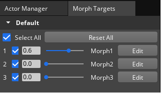
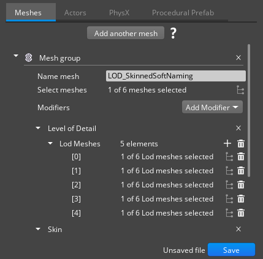
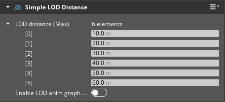

# Deforming Objects Workflow Tests

Testing in this area should focus on the Deforming Objects.

## General Docs
* [O3DE Animation Editor Concepts and Terms](https://www.o3de.org/docs/user-guide/visualization/animation/character-editor/concepts-and-terms/)
* [O3DE Animation Editor User Interface](https://www.o3de.org/docs/user-guide/visualization/animation/animation-editor/user-interface/)
* [O3DE Getting Started With Animation Editor](https://www.o3de.org/docs/user-guide/visualization/animation/animation-editor/quick-start/)

## Common Issues to Watch For

Test guidance will sometimes note specific issues to watch for. The common issues below should be watched for through all testing, even if unrelated to the current workflow being tested.
- Asset processor errors when saving animation settings.
- Warnings or Errors that appear in the Editor Console Log while setting up or running scenes.
- Errors appearing in the Animation Editor's Log Window view.
- Broken Animation behaviors.

## Workflows

### Area: Morphing

**Project Requirements**

Any project that has the following Gems enabled:

* O3DE\Gems\EMotionFX
* O3DE\Gems\ScriptedEntityTweener
* O3DE\Gems\PrimitiveAssets

Assets:
* Actor with morph targets and morph animation is present in the project.
* Alternatively - Actor included in AutomatedTesting project - [morphActor](https://github.com/o3de/o3de/tree/development/AutomatedTesting/Objects/MorphTargets)

**Platforms:**
* Windows
* Linux

**Docs:**
* [Using Morph Targets to Deform Characters](https://www.o3de.org/docs/user-guide/visualization/animation/animation-editor/using-morph-targets-to-deform-characters/)

**Product:** 
Actor with morph targets plays morph animation in the Animation Editor.

**Suggested Time Box:** 30 minutes per platform.

| Workflow                     | Requests           | Things to Watch For |
|------------------------------|--------------------|---------------------|
| **Import Actor with morph targets and morph animation to the Animation Editor**                         | <ol><li>Load imported Actor in the Animation Editor:   File -> Open Actor</li><li>Create a Motion Set with imported actor motions in the Motion Sets tab.</li></ol> | <ul><li>Actor is imported without any issues.</li><li>Motion Sets can be created, updated, deleted.</li><li>Motions can be added, updated, and deleted to/from motion sets.</li><li>Motion Sets are saved and processed in the Asset Processor.</li></ul>  |
| **Play morph motion**                         | <ol><li>Select morph motion in the Motions window inside the Motion Sets tab.</li><li>In the Time View tab, press Play button.</li></ol> | <ul><li>Actor mesh is distorted while the motion is active.</li><li>Error messages appear in the Animation Editor.</li><li>Editor stability issues, performance drops.</li></ul>
| **Manipulate Morph Targets** | <ol><li>Switch the Animation Editor layout to "Character" in the upper-right corner of the Animation Editor.</li><li>Select Actor instance in the Actor Manager tab.</li><li>In the Morph Targets tab, check the desired morph targets.</li><li>Edit morph target by pressing the Edit button, set Range Min. and Range Max. to various values.</li><li>Manipulate morph targets by using the sliders or the value fields.</li> </ol> | <ul><li>Stability issues when switching the Animation Editor layout.</li><li>Morph targets of the actor are not displayed in the Morph Targets tab.</li><li>Morph targets Range Min and Range Max cannot be edited.</li><li>Manipulating morph targets does not modify the actors mesh in the Animation Editor Viewport.</li><li>Manipulating morph targets causes the actor mesh disruption in the Animation Editor Viewport.</li></ul>

### Area: Level of Detail

**Project Requirements**

Any project that has the following Gems enabled:

* O3DE\Gems\EMotionFX
* O3DE\Gems\ScriptedEntityTweener
* O3DE\Gems\PrimitiveAssets

Assets:
* Actor with Level of Detail is present in the project.

**Platforms:**
* Windows
* Linux

**Docs:**
* [Scene Settings](https://www.o3de.org/docs/user-guide/assets/scene-settings/scene-settings/)
* [Using Actor LODs to Optimize Game Performance](https://www.o3de.org/docs/user-guide/visualization/animation/using-actor-lods-optimize-game-performance/)

**Product:** 
Actor with Level of Detail setup working in the Editor.

**Suggested Time Box:** 30 minutes per platform.

| Workflow                     | Requests           | Things to Watch For |
|------------------------------|--------------------|---------------------|
| **Import actor with Level of Detail setup**                         | <ol><li>Open Scene Settings for the imported actor - In the Asset Browser find the imported actor, press RMB on it and select the Edit Scene Settings.</li><li>In the Meshes tab, add Level of Detail modifier.</li><li>Add a LOD in Level of Detail modifier and assign a desired LOD mesh in each added LOD.</li></ol>    | <ul><li>Actor is imported without any issues.</li><li>Scene Settings tool opens without issues for the imported actor.</li><li>Level of Detail modifier can be added to the actor in Scene Settings tool.</li><li>LODs can be added in Level of Detail modifier.</li></ul>  |
| **Create an entity with Level of Detail**                         | <ol><li>Create a new entity with Actor and Simple LOD Distance components.</li><li>In the Actor component assign previously modified actor with Level of Detail modifier.</li><li>In Simple LOD Distance component, define distance from camera at which particular LOD meshes should be displayed.</li></ol> | <ul><li>The actors mesh is not modified when the camera is zoomed out for a certain distance.</li><li>Errors appear in Editor Console.</li><li>Editor stability issues, performance drops.</li></ul>
| **Activate Level of Detail in Editor** | <ol><li>Zoom camera away from LOD entity.</li><li>Zoom camera towards LOD entity.</li><li>Modify the LOD distance in Simple LOD Distance component for each LOD element.</li><li>Zoom camera in and out again.</li> </ol> | <ul><li>Mesh of LOD entity does not update.</li><li>Errors appear in Editor Console.</li><li>Editor stability issues, performance drops.</li></ul>
---
