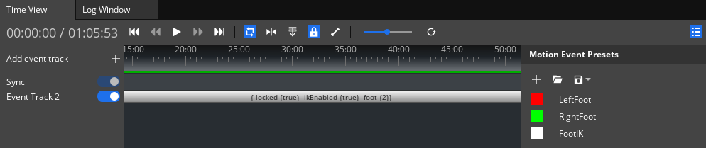

# FootIK Workflow Tests

Testing in this area should focus on the FootIK.

## General Docs
* [Animation Editor User Interface](https://www.o3de.org/docs/user-guide/visualization/animation/animation-editor/user-interface/)
* [Animation Editor Concepts and Terms](https://www.o3de.org/docs/user-guide/visualization/animation/character-editor/concepts-and-terms/)

## Common Issues to Watch For

Test guidance will sometimes note specific issues to watch for. The common issues below should be watched for through all testing, even if unrelated to the current workflow being tested.

- Issue with foot not fitting to the slope accurately.

## Workflows

### Area: Setting up FootIK for an Actor in the Animation Editor

**Project Requirements**

Any project that has the following Gems enabled:
* An Actor (fbx) file set up for Motions (for example *Rin.fbx* supplied by the Motion Matching Gem).
* Multiple motions that work with the actor (Motion Mating Gem contains a *MotionMatching.motionset* for the *Rin.fbx* actor).

**Editor Platforms:**
* Windows
* Linux

**Product:** An Actor with FootIK configured in Animation Editor

**Suggested Time Box:** 30 minutes per platform.

| Workflow                     | Requests           | Things to Watch For |
|------------------------------|--------------------|---------------------|
| **Setup Animation Editor environment**                         | <ol><li>Open the O3DE Editor.<li> Open the Animation Editor (by one of two available paths):<ul><li>O3DE Toolbar → Tools → Animation Editor</li><li>Actor Component's Actor asset property field.</li></ul></li><li> Make sure that the current Animation Editor layout is set to AnimGraph. Layout can be changed by expanding the dropdown menu in the top right corner of the Animation Editor. </li><li>Go to File → Open Actor and select your actor file (for example Rin.fbx). </li> <li> In the MotionSets window, load your MotionSet asset (i.e. _MotionMatching_, also remove the _Default_ motionset if it is listed in the MotionSets window). </li> <li> In the AnimGraph window, create a new AnimGraph by clicking the "+" button in the top left corner of the window. </li></ol> | <ul><li>Animation Editor launches.</li> <li>Your Actor file is avaliable for selection.</li><li>Animation Editor layout can be changed to AnimGraph.</li><li>MotionSets can be loaded and removed in the MotionSets window.</li><li>New AnimGraphs can be created.</li></ul>  |
| **Setup FootIK for an Actor**                         | <ol> <li> In the **Time View** window Add new motion event preset by clicking the "+" button in **Motion Event Presets** window (If it is not visible, click on the "Show/Hide presets" button in top right corner of the Time View window). </li> <ul><li>Name the preset "FootIK".</li><li>Add **EventDataFootIK** Event Data by clicking the "+" button and selecting it (check the "Foot locked" box).</li></ul> <li> In the **MotionSets** window select the loaded MotionSet in "Motion Set Management", then select one of the motions listed in the Motion Set. </li> <li> Add a new **Event Track** in the Time View window.</li> <li>Drag and drop the previously created **"FootIK"** Motion Event preset onto the new Event Track.</li> <ul><li>Hover the cursor over the edges of the added Motion Event on the Event Track and extend the Motion Event so it is active at all times while the motion is being played. </li></ul> <li>Create the following parameters in the **Parameters** window: <ul><li> _FootIK_ - Float value </li> <li> _FootLock_ - Boolean value</li> <li> _Hips_ - Boolean value</li></ul> </li> <li> Add a **Blend Tree** node to the previously created AnimGraph by right-clicking on the AnimGraph and selecting it from the dropdown menu (Sources -> BlendTree).</li> <ul><li>Double left-click **Blend Tree** node to open it.</li> <li>Add following nodes to the **Blend Tree**:<ul> <li>_Motion_ (Sources -> Motion)</li> <li>_Footplant IK_ (Controllers -> Footplant IK)</li> <li>_Parameters_ (Sources -> Parameters)</li></ul></li> <li>Select Motion node and in **Inspector** select the motion that has "FootIK" Motion Event preset added to it. Then, connect the node _Output pose_ to _Pose_ in the _Footplant IK_ node.</li> <li>Connect Parameters as following to the _Footplant IK_ node: <ul> FootIK → Weight </ul> <ul>FootLock → Lock Feet </ul> <ul> Hips → Adjust Hip </ul> <li>Connect **output Pose** from the _Footplant IK_ node to **Input Pose** of the _FinalNode_.</li><li>Select the _Footplant IK_ node and in **Inspector** assign the joints to the corresponding property listed under the General settings.<ul><li>**Example**:</li> Left foot joint → _L_foot_JNT_</ul><ul>Left toe joint → _L_toe_JNT_</ul><ul> Right foot joint → _R_foot_JNT_</ul><ul>Right toe joint → _R_toe_JNT_</ul><ul>Hip joint → _C_pelvis_JNT_</ul></li></li></ul></ol> | <ul><li>New Motion Events can be created in the Time View window.</li>  <li>After selecting motion in the MotionSets window, motion is displayed in the Time View window.</li><li>New Event Track can be added to the motion in the Time View window.</li><li>Motion Event can be added to the motion in the Time View window and extended so it is active at all times.</li>  <li>New Parameters with various values can be created.</li><li>Nodes can be added to the AnimGraph, BlendTree can be opened by double left-clicking it.</li><li>Nodes can be connected to each other.</li>  <li>Nodes in the AnimGraph can be modified in the Inspector.</li>  </ul>  ||
| **Verify FootIK functionality in Atom Render Window**                         | <ol><li>In **AnimGraph** Blend Tree, select the Motion node and check the "In Place" box.</li><li>Click the Play button on top of the **AnimGraph** window.</li> <li>In **Parameters** window, increase the value of _FootIK_ parameter to 1.0.</li> <ul><li>Move the camera in Atom Renderer window so the Actor is visible.</li> <li>Use the transform gizmo to move the Actor up and down. Notice that the knees of the Actor are bending while feet are not clipping through the ground.</li></ul><li>In **Parameters** window, set the value of the _FootLock_ parameter to true.</li><ul><li>Notice that the Actor's feet have stopped moving while other joints of the Actor are still moving.</li></ul> <li>Move the Actor slightly above the ground, then in **Parameters** window set the value of the _Hips_ parameter to true.</li><ul><li>Notice that the Actor is moved down after setting _Hips_ value to true; The Actor's feet touch the ground.</li></ul></ol> | <ul><li>Motion is played in place if "In Place" option is checked in the Motion node.<li>Actor instance needs to be selected to play the AnimGraph, if AnimGraph is not played after clicking the Play button, go to the **Actor Manager** window and select the Actor instance.</li><li>Parameters can be modified when the AnimGraph is being played.</li><li>The Actor's feet are not clipping through the ground when the FootIK parameter is set to 1.0.</li><li>The Actor is lowered so its feet touch the ground if the Actor is slightly above the ground and Hips parameter is set to true.</li></li></ul>  |
---
# Final Product
  