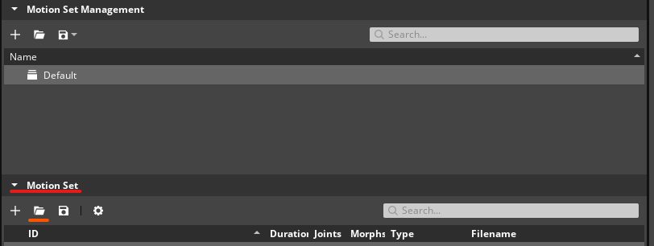
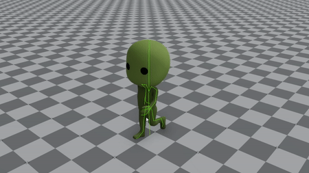
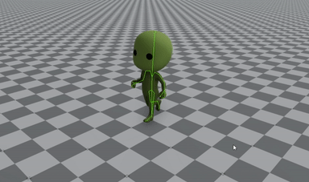

# Root Motion Extraction Workflow Tests

Testing in this area should focus on the Root Motion Extraction to provide data driven animation events.

## General Docs
* FEATURE DOCS UNDER DEVELOPMENT
* [O3DE Animation Overview](https://www.o3de.org/docs/user-guide/visualization/animation/)
* [O3DE Getting Started With Animation Editor](https://www.o3de.org/docs/user-guide/visualization/animation/animation-editor/quick-start/)

## Common Issues to Watch For

Test guidance will sometimes note specific issues to watch for. The common issues below should be watched for through all testing, even if unrelated to the current workflow being tested.
- Actor file fails to process after generating the root motion.
- Actor fails to animate or animates in an unexpected way after the root motion has been extracted.

## Workflows

### Area: Configure Actor and apply a Root Motion Extraction

**Project Requirements**
A project set up with the following gems:
* EMotion FX Animation
* Scene Processing

Assets:
* FBX source file that contains an actor and at least one motion.
* Motion file contains movement from the hit/pelvis joint, but do not have root motion baked in.
* You can download Mixamo asset for testing.
* Alternatively you can use this [MainPlayer.zip](testassets/MainPlayer.zip) by extracting it into your project.

**Editor Platforms:**
* Windows
* Linux

**Product:** An actor that animates with a Root Motion Extraction 

**Suggested Time Box:** 60 minutes per platform.

| Workflow                                                      | Requests                                                                                                                                                                                                                                                                                                                                                                                                                                                                                                                                                                                                                                                                                                                                                                                                                                                                  | Things to Watch For                                                                                                                                                                                                                                                                                                                                                                                                                                                                                                                                                                                                                                                                                             |
|---------------------------------------------------------------|---------------------------------------------------------------------------------------------------------------------------------------------------------------------------------------------------------------------------------------------------------------------------------------------------------------------------------------------------------------------------------------------------------------------------------------------------------------------------------------------------------------------------------------------------------------------------------------------------------------------------------------------------------------------------------------------------------------------------------------------------------------------------------------------------------------------------------------------------------------------------|-----------------------------------------------------------------------------------------------------------------------------------------------------------------------------------------------------------------------------------------------------------------------------------------------------------------------------------------------------------------------------------------------------------------------------------------------------------------------------------------------------------------------------------------------------------------------------------------------------------------------------------------------------------------------------------------------------------------|
| **Add Root Motion Modifier to an Actor.**                     | <ol><li>Launch the Editor</li><li>Navigate to Asset browser, find the source file (EG: Main_Player_Non_Mix.fbx).</li><li>Double click the file in the list to open an options menu and select 'edit settings'</li><li>In the Motions Tab Add a Root Motion Extraction modifier and update the actor.</li></ol>                                                                                                                                                                                                                                                                                                                                                                                                                                                                                                        | <ul><li>Root Motion Extraction rule showing up properly.</li><li>You can change the settings of the rule.</li><li>After update, motion file generated correctly in AP without any warnings / errors.</li></ul>                                                                                                                                                                                                                                                                                                                                                                                                                                                                                                  |
| **Set up Root Motion Extraction and play it in EMFX Editor.** | **Prerequisite:** <ol><li>Completed **Add Root Motion Modifier to an Actor** workflow on your actor asset under test.</li><li>Make sure the actor file also exported correctly.</li></ol> **Steps:** <ol><li>Launch the Editor.</li><li>Launch Animation Editor.</li><li>Open the modified actor file from **Add Root Motion Modifier to an Actor** workflow.</li><li>Open the motion.<ul><li>Switch to Animation Layout.</li><li>Select the Default motionset from Motion Set Management.</li><li>Click the open file button in the Motion Set window (highlighted in the image below) and open the Main_Player_Non_Mix fbx file.</li></ul></li><li>Open Actor Manager (Toolbar → View → Actor Manager).</li><li>From the **Actor Manager** view set the **Motion Extraction Joint** by clicking **Find Best Match**</li></ol> | The movement of the root joint is a projected position of the hip / pelvis joint on the ground.  Before setting Motion Extraction Joint the motion should play like this gif. Notice that the root of the character is moving along with the character, and the character is popping back to the origin.    After setting Motion Extraction Joint the motion should play like this gif. Notice that the root of the character is moving along with the character, and the character is NOT popping back to the origin, which is an indication that root motion extraction is activated in runtime.   |
---

