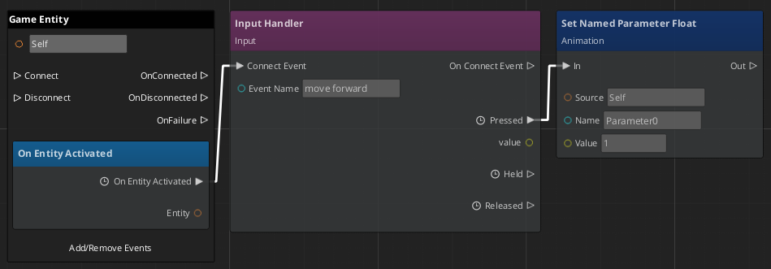
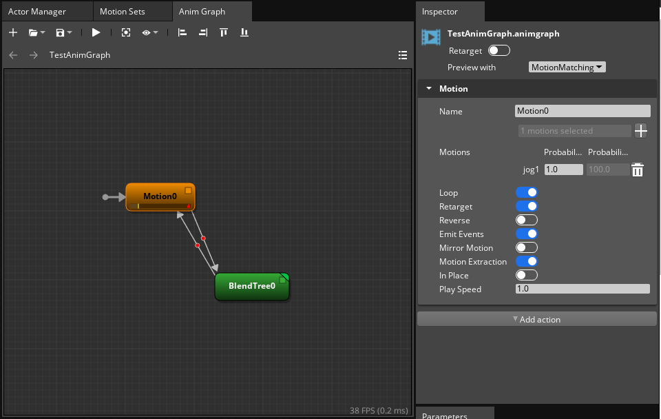
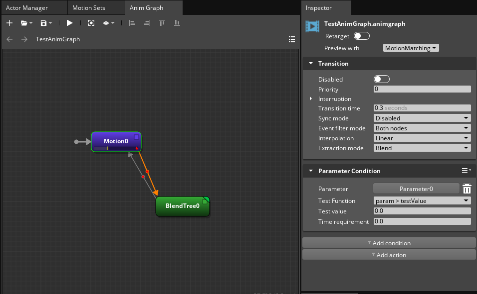
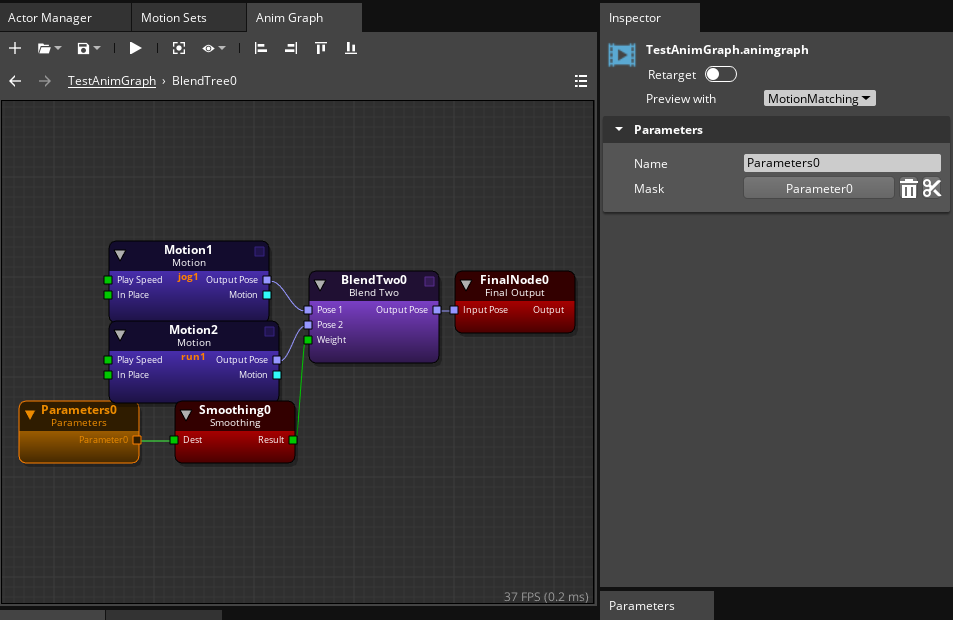

# Purpose

This reference file is intended to show what example assets looked like when created. The reason to do this is that systems can be updated causing example assets to go out of date. Having screenshots of their setup allows for rebuilding of assets in new formats when upgrading is not possible.

# Files

## TestSC.scriptcanvas

Example Script Canvas created referencing **thirdpersonmovement.inputbindings** from the **Starting Point Input Gem**. 

## TestAnimGraph.animgraph

Example created using the **Rin.fbx** Actor and **MotionMatching.motionset** assets from the Motion Matching Gem.

| **Top Level Motion**               |  |
|------------------------------------|--------------------------------------------|
| **Top Level Parameter Transition** |                          |
| **Blend Tree**                     |                                            |

