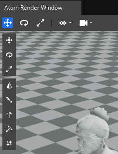
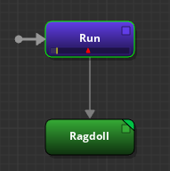

# Ragdoll Authoring Improvements Workflow Tests

Testing in this area should focus on the new Ragdoll Authoring Improvements.

## General Docs

* [Animation Editor User Interface](https://www.o3de.org/docs/user-guide/visualization/animation/animation-editor/user-interface/)
* [Creating and Simulating a PhysX Ragdoll](https://www.o3de.org/docs/user-guide/visualization/animation/animation-editor/creating-and-simulating-physx-ragdoll/)
* [Setting up a Ragdoll](https://stabilization-22-10--o3deorg.netlify.app/docs/user-guide/visualization/animation/animation-editor/ragdoll/ragdoll-physics-setup/)

## Common Issues to Watch For

Test guidance will sometimes note specific issues to watch for. The common issues below should be watched for through all testing, even if unrelated to the current workflow being tested.
- Issues with the Editor running in the background when Animation Editor is running (for example freezing when saving changes to an actor).
- Wiremesh highlighting/coloration in the Atom Render Window does not change properly when hovered over, or is not updated properly when modified.
- Certain actions not being written to the Action History and being unaffected by the Undo/Redo actions.
- No warning/save popups in the Animation Editor (for example when an Autosave is performed, or when a Motion Set is mising when attempting to use *Automatic joint limit setup*).

## Workflows

### Area: Ragdoll Authoring Improvements

**Project Requirements**

Any project that has the following Gems enabled:
* An actor (fbx) file set up for Motions (for example *Rin.fbx* supplied by the Motion Matching Gem).
* Multiple motions that work with the actor (Motion Mating Gem contains a *MotionMatching.motionset* for the *Rin.fbx* actor).

**Editor Platforms:**
* Windows
* Linux

**Product:** An actor that is configured to ragdoll that can be placed in a scene.

**Suggested Time Box:** 60 minutes per platform.

| Workflow                                  | Requests                                                                                                                                                                                                                                                                                                                                                                                                                                                                                                                                                                                                                                                                                                                                                                                                                                                                                                                                                                                                                                                                                                                                                                                                                                                                                                                                                                                         | Things to Watch For                                                                                                                                                                                                                                                                                                                                                                                                                                                                                                                                                                                                                                                                                                                                                                                                                                |
|-------------------------------------------|--------------------------------------------------------------------------------------------------------------------------------------------------------------------------------------------------------------------------------------------------------------------------------------------------------------------------------------------------------------------------------------------------------------------------------------------------------------------------------------------------------------------------------------------------------------------------------------------------------------------------------------------------------------------------------------------------------------------------------------------------------------------------------------------------------------------------------------------------------------------------------------------------------------------------------------------------------------------------------------------------------------------------------------------------------------------------------------------------------------------------------------------------------------------------------------------------------------------------------------------------------------------------------------------------------------------------------------------------------------------------------------------------|----------------------------------------------------------------------------------------------------------------------------------------------------------------------------------------------------------------------------------------------------------------------------------------------------------------------------------------------------------------------------------------------------------------------------------------------------------------------------------------------------------------------------------------------------------------------------------------------------------------------------------------------------------------------------------------------------------------------------------------------------------------------------------------------------------------------------------------------------|
| **Setup a ragdoll for an actor**          | <ol><li>Open the O3DE Editor.</li> <li> Open the Animation Editor (using varying entry points):<ul><li>O3DE Toolbar → Tools → Animation Editor</li><li>Actor Component's Actor asset property field.</li></ul></li> <li>Make sure that the current Animation Editor layout is set to Physics. Layout can be changed by expanding the dropdown menu in the top right corner of the Animation Editor.</li> <li> Go to File → Open Actor and select your actor file (for example *Rin.fbx*).</li> <li>In the Skeleton Outliner, add a collider shape to the desired bones:<ul><li>**Right-Click → Ragdoll → Add to Ragdoll**.</li><li>From the Inspector pane **Add Property → Ragdoll → Desired Collider Shape** from the Node Properties. [o3de/o3de#13278](https://github.com/o3de/o3de/issues/13278) </li><li>For example on the *Rin.fbx* you would configure the following bones: <ul><li>*L_wrist_INT*</li><li>*C_head_INT*</li><li>*R_wrist_INT*</li><li>*L_foot_INT*</li><li>*R_foot_INT*</li></ul></li></ul> </li></ol>                                                                                                                                                                                                                                                                                                                                                                                  | <ul><li>Animation Editor launches.</li> <li>Your actor file is avaliable for selection.</li><li>Animation Editor layout can be changed to Physics.</li><li>Actor bones are listed in the Skeleton Outliner while it is opened in the Animation Editor.</li><li>Selected actor bones can be added to the ragdoll via Skeleton Outliner's context menu.</li><li>Selected actor bones can be added to the ragdoll via the Inspector pane. [o3de/o3de#13278](https://github.com/o3de/o3de/issues/13278) </li><li>Collider can be removed from bones added to the ragdoll.</li></ul>                                                                                                                                                                                                                                                                    |
| **Verify Atom Render Window UI clusters** | <ol><li>Click the filter button in the top right corner of the Skeleton Outliner and check the *Ragdoll joints and colliders* filter for easier navigation.</li><li>In the Skeleton Outliner select a bone that has both a collider, and a joint limit enabled (for example *L_wrist_INT* from the *Rin.fbx*).</li> <li>With the bone still selected, deselect the *Has joint limit* in the Joint Limit component in the Inspector pane.</li> <li>In the Skeleton Outliner select a bone, right-click it, and select **Ragdoll → Remove Colliders** from the context menu.</li> <li>Select bones in the Skeleton Outliner that either have both, one of, or no collider and joint limit enabled.</li><li>In the Skeleton Outliner select a bone that has both a collider and a joint limit enabled (for example *L_wrist_INT* from the *Rin.fbx*). Select all buttons from both clusters in the Atom Render Window in order. For the *Automatic joint limit setup* button, the Animation Editor layout has to be changed to AnimGraph (from Physics) and your Motion Set (for example *MotionMatching.motionset*) has to be added under the Motion Sets → Motion Set Management by clicking the *Load motion set from file* button. You can enable *Ragdoll Colliders* and *Ragdoll Joint Limits* under the *eye* button dropdown menu in the Atom Render Window for more visual clarity.</li></ol> | <ul><li>Filters properly apply to relevant bones.</li><li>Two button clusters show up in the top-left corner of the Atom Render Window when relevant bones are selected. First cluster from the top has three buttons used for modifying collider translation, rotation, and dimensions. Second cluster from the top has five buttons used for adjusting joint limits.</li>   <li>Disabling/enabling colliders/*Has joint limit* property hides/shows their relevant button clusters.</li><li>Switching between different bones properly updates button clusters.</li><li>Manipulators that show up in the Atom Renderer Window are functional and their changes are retained after being deselected.</li><li>Adding a Motion Set allows the *Automatic joint limit setup* button to be used.</li></ul> |
| **Manipulators** | <ol><li>In the Animation Editor open the Action History, by going to View → Action History. Place the window in a visible and convenient place (for example dock it under the Skeleton Outliner pane).</li> <li>Modify any bone using any of the manipulators in the Atom Renderer Window (same as in the *Verify Atom Render Window UI clusters* workflow).</li> <li>Modify any bone by changing properties related to the button clusters under the property components in the Inspector pane (for example *Swing limit Y*, or *Twist upper limit*).</li> <li>Perform Undo/Redo actions on changes made by using Atom Render Window, and modifying properties under the Ragdoll pane. Undo/Redo actions can be performed by using Ctrl+Z/Ctrl+Shift+Z shortcuts, or by selecting Edit → Undo/Edit → Redo.</li></ol>                                                                                                                                                                                                                                                                                                                                                                                                                                                                                                                                                                           | <ul><li>Action History can be opened.</li><li>Modifications made in the Atom Render Window using the manipulators is saved to the Action History and is affected by Undo/Redo actions.</li><li>Modifications made in the Ragdoll pane by adjusting properties is saved to the Action History and is affected by Undo/Redo actions.</li></ul>                                                                                                                                                                                                                                                                                                                                                                                                                                                                                                       |
| **Joint Limit Optimization** | <ol><li>Remove the added Motion Set, by going to the AnimGraph layout → Motion Sets pane → Motion Set Management, right-clicking your Motion Set, and selecting *Remove selected* from the context menu.</li><li>Go back to the Physics layout, select a bone with joint limit enabled in the Skeleton Outliner, and press the *Automatic joint limit setup* button at the bottom of the clusters in the Atom Render Window.</li><li>Add the Motion Set back, by changing the layout to AnimGraph (from Physics), and add your Motion Set (for example *MotionMatching.motionset*) under the Motion Sets → Motion Set Management by clicking the *Load motion set from file* button.</li><li>Go back to the Physics layout and press the *Automatic joint limit setup* button at the bottom of the clusters in the Atom Render Window.</li></ol>                                                                                                                                                                                                                                                                                                                                                                                                                                                                                                                                                 | <ul><li>Motion Sets can be removed and added in the Animation Editor.</li><li>A message pops up if there is no Motion Set loaded while the user tries to use the *Automatic joint limit setup*.</li><li>*Automatic joint limit setup* properly overwrites any changes made to the joint limit and roughly matches the expected range of movement.</li><li>Joint limits adjusted by *Automatic joint limit setup* should roughly match the movement given bone could be doing (for example a knee joint should have a cone close to 180 degrees in one direction and narrow range of movement in the other direction).</li></ul>                                                                                                                                                                                                                    |
| **Self-collision Warning** | <ol><li>Make sure that the Ragdoll Collider drawing is enabled under the *eye* button dropdown menu.</li><li>See if there are any bones present with red wiremeshes. For example on the *Rin.fbx* skeleton set up in these workflows, these should be *L_leg_INT* and *R_leg_INT*. Red coloration of the wiremesh means that two joints **which are not adjecent in the hierarchy** (for example *R_knee_INT* from the *Rin.fbx* bone is adjacent to *R_leg_INT* and *R_foot_INT*) are colliding with each other. This can be fixed by removing the collision of one of the intersecting bones (select a bone in the Skeleton Outliner and choose Ragdoll → Remove colliders), or by simply moving/rotating the bones so that they do not intersect, by changing their Offset/Rotation properties. </li> <li>Select a bone and move/rotate it around by modifying the collider's Offset/Rotation properties under the Ragdoll pane, or using relevant manipulators in the Atom Render Window.</li></ol>                                                                                                                                                                                                                                                                                                                                                                                          | <ul><li>Ragdoll Collider drawing can be enabled and draws wiremeshes of the bones added to the ragdoll.</li><li>Intersecting non-adjacent in hierarchy bones have red wiremeshes instead of grey.</li><li>Moving/rotating bones around properly updates the wiremesh coloration if an unallowed intersection occurs.</li></ul>                                                                                                                                                                                                                                                                                                                                                                                                                                                                                                                     |
| **Picking and hovering** | <ol><li>Select different joints by clicking on their wiremeshes in the Atom Render Window.</li><li>Hover over different bones in the Skeleton Outliner.</li></ol>                                                                                                                                                                                                                                                                                                                                                                                                                                                                                                                                                                                                                                                                                                                                                                                                                                                                                                                                                                                                                                                                                                                                                                                                                                | <ul><li>Bones can be selected by clicking their wiremeshes in the Atom Render Window.</li><li>Hovering over bones in the Skeleton Outliner highlights them with a bright color in the Atom Render Window.</li><li>If hovering over different bones does not work, please enable/disable the *Line Skeleton* under the *eye* button dropdown in the Atom Render Window.</li></ul>                                                                                                                                                                                                                                                                                                                                                                                                                                                                   |
---

### Area: Using Ragdoll in a Scene

**Project Requirements**
* An actor (fbx) file set up for Motions (for example *Rin.fbx* supplied by the Motion Matching Gem) and configured to ragdoll (please refer to the *Area: Ragdoll Authoring Improvements*).
* Multiple motions that work with the actor (Motion Mating Gem contains a *MotionMatching.motionset* for the *Rin.fbx* actor).

**Editor Platforms:**
* Windows
* Linux

**Product:** An entity in the scene that ragdolls on an event.

**Suggested Time Box:** 30 minutes per platform.

| Workflow                     | Requests           | Things to Watch For |
|------------------------------|--------------------|---------------------|
| **Prepare Anim Graph**       | <ol><li>Open the O3DE Editor.</li> <li> Open the Animation Editor (using varying entry points):<ul><li>O3DE Toolbar → Tools → Animation Editor</li><li>Actor Component's Actor asset property field.</li></ul></li> <li>Make sure that the current Animation Editor layout is set to AnimGraph. Layout can be changed by expanding the dropdown menu in the top right corner of the Animation Editor.</li><li> Go to File → Open Actor and select your actor file (for example *Rin.fbx*).</li> <li>Add your actor's Motion Set (for example for *Rin.fbx* it is *MotionMatching.motionset*) by going to Motion Sets → Motion Set Management, clicking the *Load motion set from file* button and choosing the .motionset file.</li> <li>In the Anim Graph tab create a new Anim Graph by clicking the *+* button (*Create a new anim graph*) in the pane's top left corner.</li><li>Add a *Motion* node to the Anim Graph by doing **Right-click on the Anim Graph → Create Node → Sources → Motion** or by dragging it from **View → Palette Window → Sources → Motion**.</li><li>Select the created *Motion* node and view it in the *Inspector* pane. Change its *Name* (for example to *Run*). Choose a motion by clicking the *+* button (*Add motions*) and selecting one of the motions available in your actor's Motion Set (for example on *MotionMatching.motionset* choose *run1*).</li><li>Add a *Blend Tree* node to the Anim Graph by doing **Right-click on the Anim Graph → Create Node → Sources → Blend Tree** or by dragging it from **View → Palette Window → Sources → Blend Tree**.</li><li>Select the created *Blend Tree* node, and view it in the *Inspector* pane. Change its *Name* (for example to *Ragdoll*).</li><li>Connect the *Motion* node to the *Blend Tree* node by **Left-clicking the *Motion* node, holding the mouse button, and dragging it over the *Blend Tree* node**.</li><li>Select the created transition arrow and in the *Inspector* pane add a *Time Condition* by **clicking the *Add condition* button, and selecting *Time Condition* from the dropdown menu**.</li><li>Double click the *Blend Tree* node to open it and add an *Activate Ragdoll Joints* node by doing *Right-click on the graph → Create Node → Physics → Activate Ragdoll Joints* or by dragging it from **View → Palette Window → Physics → Activate Ragdoll Joints**. </li><li>Connect the *Output Pose* from the *Activate Ragdoll Joints* node to the *Input Pose* of the *Final Node*.</li><li>Select the *Activate Ragdoll Joints* and add your actor's joints by clicking the *branch* button next to the *Simulated Joints* parameter (for *Rin.fbx* add all joints present). </li><li>Save the created Anim Graph by going to **File → Save All** or pressing *Ctrl+S* shortcut.</li></ol> | <ul><li>Animation Editor launches.</li> <li>Your actor file is avaliable for selection.</li><li>New Anim Graphs can be created.</li><li>Nodes can be added to Anim Graphs.</li><li>Properties of the nodes in the Anim Graph can be adjusted.</li><li>Nodes can be connected in the Anim Graph. Example of two nodes connected:</li>  <li>Transition arrows can be modified in the *Inspector*.</li><li>Nodes can be added in the *Blend Trees*.</li><li>Anim Graphs can be saved.</li></ul>  |
| **Create Ragdoll entity**    | <ol><li>Create an entity in the Level by either **Right-click in the Viewport → Create entity** or **Right-click in the Entity Outliner → Create entity**</li><li>Add the following components to the entity by selecting it and clicking the *Add Component* button in the *Entity Inspector*:<ul><li>*Actor*</li><li>*Anim Graph*</li><li>*PhysX Ragdoll*</li></ul></li><li>In the *Actor* component's *Actor asset* property assign your actor asset (for example *Rin.fbx*).</li><li>In the *Anim Graph* component's *Anim graph* property select the Anim Graph you have saved in the *Prepare Anim Graph* workflow and in the *Motion set asset* property select your actor's Motion Set (for example for *Rin.fbx* it is *MotionMatching.motionset*).</li><li>Enter the Game Mode by either clicking the *Play Game* button in the top right Viewport corner or pressing *Ctrl+G*.</li></ol> | <ul><li>Entities can be created.</li><li>Components can be added to entities.</li><li>Assets can be assigned to the Actor/Anim Graph components.</li><li>Created entity properly ragdolls.</li><li>If the workflow was performed using the examples, then the *Rin.fbx* entity should begin to run and ragdoll after a one second passes after entering the Game Mode.</li></ul>  |
| **Assigning Physics material to PhysX Ragdoll bones** | <ol><li>Open the tested actor with Animation Editor and go to Physics layout, select a bone with ragdoll collider in the Skeleton Outliner and change its assigned Physics material.</li><li>Enter the game mode with PhysX ragdoll entity that has different materials assigned to its ragdoll colliders.</li></ol> | <ul><li>Behaviors of ragdoll colliders is corresponding to set materials during simulations.</li></ul> |
---
